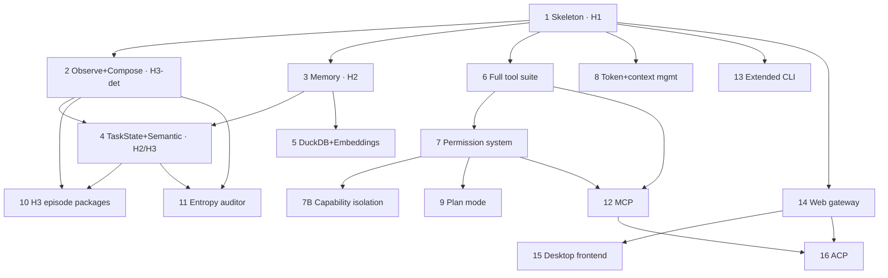

# Rusty Keys — implementation roadmap

The full system as a dependency-sequenced plan. **Each phase is a working, runnable
system — not a milestone toward one.** Issues are tracked on GitHub; each item links
to its issue and carries a size tag.

## How to read this

Each phase states its **goal + maturity target**, what it **depends on**, a rough
**size**, the **items** (with size tags `S`/`M`/`L`/`XL` and issue refs), a binary
**Definition of Done**, observable **Acceptance criteria**, the **Test gate** that
must pass, top **Risks**, and a one-command **Demo**. DoD = "what's finished
(incl. tests/docs)"; AC = "what it observably does".

Authoritative companions: [`docs/ARCHITECTURE.md`](docs/ARCHITECTURE.md),
[`docs/architecture/data-model.md`](docs/architecture/data-model.md),
[`docs/reference/configuration.md`](docs/reference/configuration.md),
[`docs/dev/`](docs/dev) (error-handling, testing-strategy, eval-plan, coding-standards),
[`docs/adr/`](docs/adr).

## Phase dependency graph

## Engineering substrate — lands WITH Phase 1, not after

These are not a phase; they are the floor every phase builds on (see the dev docs):

- **Error model** (`docs/dev/error-handling.md`, ADR-0023): one `thiserror` enum per
  library crate, `anyhow` only in `app`, the no-panic rule enforced by clippy lints.
- **`ToolOutcome` contract** (ADR-0022): status carried structurally — never re-parsed
  from a result-string prefix. Lands with the first tool.
- **`async before_tool`** (ADR-0016): the policy hook is `async` from Phase 1 so the
  ApprovalGate (Phase 7) is **not** a breaking change later.
- **Testing** (`docs/dev/testing-strategy.md`): the `FakeLanguageModel` scripted-turn
  fixture ships with Phase 1's `Session`, so every LLM-dependent path is testable in CI
  without a live provider.
- **Coding standards + CI** (`docs/dev/coding-standards.md`): MSRV, lints, the feature
  matrix, and `.github/workflows/ci.yml` land with Phase 1.
- **On-disk versioning** (ADR-0027): every persisted record carries `schema_version`/`v`
  from the moment it is introduced.
- **`KernelEvent`** (ADR-0034): the `on_event` hook emits one fixed event enum, consumed
  by the `Tracer` and a pull-based OTLP exporter — observability wires in here, not scattered.
- **Trust boundary before config parse** (threat-model): defer parsing untrusted workspace
  config (`.rustykeys/`, `checks.toml`, `mcp.toml`, `AGENT_GUIDE.md`) until trust is established.

## Risk register (cross-phase)

| Risk | Phase(s) | Mitigation |
|---|---|---|
| aisdk is young; provider normalization rough edges | all | Shared aisdk-client wrapper with retry/timeout (PRD 01); pin via lockfile; `FakeLanguageModel` isolates CI. |
| `async before_tool` retrofitted late = churn | 1, 7 | Make it `async` at Phase 1 (ADR-0016). |
| Secrets leak into append-only evidence journal | 2 | Redaction-by-default before any write (ADR-0026, threat-model). |
| SQLite contention across multi-session/subagents | 3, 12, 14 | WAL + `busy_timeout` + single-writer (ARCHITECTURE §10). |
| Faithfulness drift from the paper (M-HIR, entropy, episode unit) | 10, 11 | ADR-0018/0019/0020 **Accepted** — confirmed against the clean extraction (`docs/research/2605.13357v1.txt`); the freeze is DONE. Remaining risk is the ladder R1/R5 build (ADR-0035) + episode-package producers (ADR-0036). |
| Doc/spec drift across many files | all | SSOT ownership (consolidated plan); cross-link, never restate. |
| Tool side-effects escape in-process checks | 7B | Opt-in OS-sandbox `ToolExecutor` (`RUSTYKEYS_ISOLATION=sandboxed`), network-deny-by-default (ADR-0030). |
| Agent games its own eval (reads answers / benchmark) | 2, 10 | Eval-integrity guard: answer keys / expected outputs / benchmark IDs kept out of agent context (ADR-0033). |
| Paper's separability claim depends on R1 visibility-hiding + R5 all-levels adjudication (additive-capability ladder confounds H1-vs-H2) | 10, 11 | Build the controlled-visibility ablation substrate (ADR-0035); **gate any Hn-vs-Hm lift reporting until it lands.** |

---

## Phase 1 — Runnable skeleton (MVP) · H1

**Goal:** the smallest complete system — aisdk kernel + policy + core tools + CLI —
proving the Session architecture and `#[tool]` integration. No memory, no verification.
**Depends on:** — · **Size:** L

- [ ] Cargo workspace — `kernel`, `constrain`, `feed`, `observe`, `compose`, `app`, `config` (+`mcp` stub) `M` · #1
- [ ] `Config`: env resolution, `RUSTYKEYS_MODEL`, `RUSTYKEYS_WORKSPACE` `S` · #2
- [ ] `Constrain`: `Policy` (**`async before_tool`**) + `ToolDispatch` trait + `WorkspacePolicy` + `PolicyChain`; `PolicyError` **enum** `M` · #3
- [ ] `Feed`: `ToolRegistry`, `ToolFn` trait + aisdk `#[tool]` adapter, `ToolOutcome`, built-in `read_file`/`list_directory` `M` · #4
- [ ] `Observe`: `Tracer`, `Episode`, `ToolEvent`, structured trace logging `S` · #5
- [ ] `Kernel`: aisdk loop over `&dyn ToolDispatch`/`&dyn Policy` (kernel does not import feed) `M` · #6
- [ ] `App`: `Session::send()`, thin CLI REPL, startup banner `M` · #7
- [ ] **Substrate:** error taxonomy, `FakeLanguageModel` fixture, clippy lints, `rust-toolchain.toml`, CI `L`

**Definition of Done:** workspace builds on stable + MSRV; `clippy -D warnings` clean; CI green; `FakeLanguageModel` integration test drives a full `send()`; error enums + `ToolOutcome` in place.
**Acceptance:** `cargo run -- "read Cargo.toml and summarize it"` returns a reply after a vetted `read_file`; a path outside the workspace returns a `BLOCKED` string, not a panic.
**Test gate:** unit (policy boundary, ToolOutcome round-trip) + one fake-LLM integration test.
**Risks:** aisdk `#[tool]`→`ToolFn` adapter is the riskiest seam → spike it first.
**Demo:** `cargo run -- "list the files in src/ and read main.rs"`.

## Phase 2 — Observe + Compose · H3 (deterministic)

**Goal:** structured visibility + deterministic verification + the evidence journal.
**Depends on:** 1 · **Size:** M

- [ ] `EvidenceJournal`: append-only JSONL at `.rustykeys/evidence.jsonl`, `schema_version` `M`
- [ ] **Redaction-by-default** before any journal/log write (ADR-0026) `S`
- [ ] `InterventionLogger`: M-HIR, `interventions.jsonl` (+ `avoidability`/`harness_gap`/`burden`) `M`
- [ ] `Verifier`: `Check` trait, `NoToolErrors`, `CleanTermination` `S`
- [ ] `VerificationReport`: `render()`, `as_observation()`, `limits` `S`
- [ ] Failure attribution → fixed `FailureType` enum + frozen `(category, layer)` matrix `M`
- [ ] `/verify`, `/mhir` CLI commands `S`
- [ ] **Chaos / resilience eval tier** (v1): fault-inject at the `FakeLanguageModel`/`ToolOutcome` seam; resilience metric — honest degradation, never verified-success-on-fault (eval-plan) `M`

**Definition of Done:** every turn writes a versioned, redacted evidence record; failed checks produce a `FailureType` attribution; torn-line recovery tested.
**Acceptance:** a turn with a failing tool call is marked UNVERIFIED with `(tool_error, feed/tools)`; `/verify` renders the report with its `limits`.
**Test gate:** property test (JSONL round-trip, torn-line skip) + snapshot (`VerificationReport::render`).
**Risks:** redaction stripping evidence attribution needs → scrub values, not structure.
**Demo:** induce a tool error, then `/verify` and `/mhir`.

## Phase 3 — Memory (Observe + Orient) · H2

**Goal:** short-term stream → long-term graph; completes the OODA loop.
**Depends on:** 1 · **Size:** L

- [ ] Short-term `Stream` trait + `SqliteStream` (`stream.db`, WAL) `M`
- [ ] Long-term `Store` trait + SQLite impl (FTS5 lexical recall, edges) `L`
- [ ] **Recall scoring** — pinned formula (weights, decay, batch normalization, neighbor rule, output-block format) `M`
- [ ] **`recall()` → `Vec<ContextEntry>`** (ADR-0036; D5): recall/orient emit structured entries (with a v1 `influenced_decision` heuristic), not a bare `String`, so the `context_trace` producer exists and the H2 cross-session-recall gate is measurable `M`
- [ ] Tiered consolidation idle/sleep/explicit + **JSON emit contract** `L`
- [ ] Skill grooming (refine/merge/split); skills exempt from pruning `M`
- [ ] **Close the loop:** feed `Attribution` into consolidation; boost failure-born skills at recall `M`
- [ ] **Validation-gated skills** (ADR-0031): failure-born skills are candidates (no floor/exemption) until validated — online VERIFIED match / offline golden replay; `direct_edit` un-validates `M`
- [ ] `/memory`, `/reflect`, `/sleep`, `/groom` `S`

**Definition of Done:** facts/skills persist across sessions; recall surfaces a planted fact next session; consolidation output validates against the contract.
**Acceptance:** teach a fact in session A; in session B it is recalled and used; an UNVERIFIED turn produces a high-importance skill.
**Test gate:** unit (recall math) + integration (two fake-LLM sessions, cross-session recall).
**Risks:** SQLite contention if multi-session → WAL + busy_timeout.
**Demo:** `/reflect`, then `/memory`.

## Phase 4 — Task State + Semantic verification · H2 + H3 (semantic)

**Goal:** working-memory tier + LLM-judge criteria check.
**Depends on:** 2, 3 · **Size:** M

- [ ] `TaskState` (`goal`, `success_criteria`, **`scope`**, `status`) → `task.json` `S`
- [ ] `set_task`/`complete_task` tools `S`
- [ ] Task prompt injection (into orient/`extra_context`, not the static system prompt) + recall anchoring `S`
- [ ] `CriteriaJudge`: async aisdk call, per-criterion verdict; **no silent pass-as-verified** (`judge_unavailable`) `M`
- [ ] `criteria_unmet@compose/semantic` attribution `S`
- [ ] `/task` CLI `S`

**Definition of Done:** judge runs in the post-turn join; parse failure records `judge_unavailable` and bars `AutonomousVerifiedSuccess`.
**Acceptance:** with criteria set, a reply that ignores a criterion is judged `fail`; a provider error during judging does not inflate "verified".
**Test gate:** integration (fake judge returning pass/fail/garbage).
**Risks:** judge nondeterminism → optional self-consistency; thresholds are a product call.
**Demo:** `/task "add validation" criteria...`, then a reply, then `/verify`.

## Phase 5 — DuckDB + embeddings

**Goal:** optional semantic recall at scale.
**Depends on:** 3 · **Size:** M

- [ ] `Store` over `duckdb-rs` (`store.duckdb`), `list_cosine_similarity` `M`
- [ ] Embedding via aisdk embed API; dims/chunking/threshold pinned `M`
- [ ] `RUSTYKEYS_LONG_TERM_BACKEND=duckdb` `S`
- [ ] Lexical fallback + mixed-corpus blend when some memories lack embeddings `S`

**Definition of Done:** semantic recall outperforms lexical on a planted-paraphrase fixture; lexical fallback still works with no embed model.
**Acceptance:** a paraphrased query recalls the right memory under duckdb; unset embed model → lexical, no error.
**Test gate:** integration behind the `duckdb` feature.
**Demo:** set `RUSTYKEYS_EMBED_MODEL` + `=duckdb`, recall a paraphrase.

## Phase 6 — Full tool suite (Claude Code parity)

**Goal:** expand to the core coding-agent tool set.
**Depends on:** 1 · **Size:** L

- [ ] `bash`, `edit_file`, `write_file`, `glob`, `grep` with `BashGuard` checkers `L` · #8
- [ ] `web_fetch`, `web_search` — opt-in `RUSTYKEYS_ALLOW_WEB` + **SSRF/egress guard** `M` · #9
- [ ] `agent` subagent via **`SessionFactory`** + `AgentDepthPolicy` `M` · #10
- [ ] Task-management tools: `task_create/get/list/update/stop/output` `M` · #11

**Definition of Done:** each tool policy-vetted; `edit_file` read-before-edit invariant; web tools blocked from loopback/metadata IPs.
**Acceptance:** `bash("rm -rf /")` is blocked + logged; `web_fetch("http://169.254.169.254/…")` is denied.
**Test gate:** unit per security checker + egress unit tests.
**Risks:** subagent feed→app cycle → `SessionFactory` (ADR-0017).
**Demo:** ask the agent to edit a file and run a test via `bash`.

## Phase 7 — Permission system

**Goal:** full permission modes + security checkers + interactive approval.
**Depends on:** 6 · **Size:** M

- [x] `PermissionMode`: Default/Plan/AcceptEdits/ReadOnly/Restricted/Bypass `M` · #14
- [x] Security checkers: CommandInjection/PrivilegeEscalation/PathTraversal/NetworkExfil/DestructiveCommand `M`
- [x] `SecurityEvent` log `.rustykeys/security.jsonl` (structured `checker`) `S`
- [x] `ApprovalGate`: channel-based approval (uses the `async before_tool` from Phase 1) `M`
- [x] `/permissions` CLI `S`

**Definition of Done:** modes gate tool classes exhaustively; `Bypass` requires `RUSTYKEYS_ALLOW_BYPASS=1`; blocked approvals log a `tool_block` intervention.
**Acceptance:** `ReadOnly` blocks writes/bash; an approval prompt round-trips Allow/AllowAlways/Block.
**Test gate:** unit (mode gates) + integration (approval channel with a scripted responder).
**Demo:** `/permissions read_only`, attempt a write.

## Phase 7B — Capability isolation (ToolExecutor) · security backstop

**Goal:** an opt-in OS-level isolation seam so tool side-effects can't exceed their grant
even when an in-process checker misses — Anthropic's "supervise what the agent *can* do."
(ADR-0030; threat-model.)
**Depends on:** 6, 7 · **Size:** L

- [x] `ToolExecutor` seam below `feed` / above the OS — does NOT change the `constrain` vetting contract `M`
- [x] `RUSTYKEYS_ISOLATION = none | sandboxed`; default `none` (today's in-process behaviour) `S`
- [x] `sandboxed`: run tool side-effects (esp. `bash`) in an OS sandbox — Linux-first (bubblewrap/firejail), wrapping battle-tested primitives; fails closed if none present `L`
- [x] **Network-deny-by-default** inside the sandbox; egress enforced at the boundary (allowlist = capability grant, not destination filter) `M`
- [ ] Pull-based OTLP export so isolation doesn't blind operators (the VM-blocked-EDR lesson) `S`

**Definition of Done:** under `sandboxed`, a `bash` attempt to read `~/.aws/credentials` or POST to an external host fails closed at the boundary regardless of the in-process checkers; `none` is byte-for-byte today's behaviour.
**Acceptance:** the credential-exfil and approved-domain exfil cases from the threat model fail closed under `sandboxed`.
**Test gate:** integration — sandboxed `bash` escape/exfil attempts (Linux).
**Risks:** custom sandbox glue is the weakest layer → wrap mature primitives; macOS/Windows parity is a follow-on.
**Demo:** `RUSTYKEYS_ISOLATION=sandboxed`, ask the agent to exfiltrate a secret; watch it fail closed.

## Phase 8 — Token & context management

**Goal:** keep the kernel within the context window indefinitely.
**Depends on:** 1 · **Size:** M

- [x] `TokenBudget`: per-turn line items (system + recall + task + tool schemas + history) + session totals `M` · #15
- [x] Micro-compact (drop oldest turn-pairs at 80%) `S`
- [x] Session summary (aisdk summarisation at 90%) `M`
- [x] Full compact (`/compact` or 95%) `S`
- [x] Recall+history de-dup precedence rule `S`
- [x] `/cost` CLI `S`

**Definition of Done:** compaction events journaled; line-item budget feeds the thresholds (not history alone).
**Acceptance:** a long session triggers micro→session→full in order without losing the active task.
**Test gate:** integration (scripted long history hits each tier).
**Demo:** drive a long conversation, watch `/cost` + compaction.

## Phase 9 — Plan mode

**Goal:** read-only proposal phase before destructive execution.
**Depends on:** 7 · **Size:** S

- [x] `enter_plan_mode`/`exit_plan_mode` tools `S` · #16
- [x] `Plan` permission mode enforced at policy `S`
- [x] CLI approval on `exit_plan_mode` (Proceed/Reject/Annotate) `S`
- [x] `/plan` shortcut `S`
- [x] **Divergent "explore" option** (ADR-0032, opt-in): fan out N isolated subagents under cognitive frames via `SessionFactory`, then critic/converge top-K; cost-gated `M`

**Definition of Done:** writes/bash blocked in plan mode; approval transitions mode; plan approval is not an intervention.
**Acceptance:** in plan mode an `edit_file` is blocked; on Proceed the next turn may write.
**Test gate:** integration (plan→approve→write).
**Demo:** `/plan "refactor X"`.

## Phase 10 — H3 episode packages

**Goal:** the formal reproduce → attribute → fix → verify → report workflow (+ back-edge).
**Depends on:** 2, 4 · **Size:** L

- [x] `DeterministicCheck` registry + `checks.toml` (project + local precedence) `M` · #21
- [x] `reproduce`, `attribute_failure` (fixed `FailureType`), `verification_report` tools `M`
- [x] `ReproduceBeforeEdit`, `VerificationReportRequired` checks (H3) `S`
- [x] **Versioned `EpisodePackage`** with all 8 traces incl. `context_trace` → `episodes/` `M`
- [x] **Episode-package assembly projector** (ADR-0036; D5): the `compose`-time builder between raw evidence and the 8 typed traces — define `ActionEvent` and project `action_trace` (read_file/edit_file/run_tool/write_report/update_task_state/inspect_diff/declare_complete, distinct from `tool_trace`), the `tool_trace` `recovered`/`exit_code`/`timeout` fields, and the `CheckResult`→`VerifyEntry` (`method`/`covers[]`/`interpretation`) producers `M`
- [x] **Per-turn intervention filter** (ADR-0036): pin which `intervention_log` records (by `source_message_id`/time-window) belong to *this* turn's package `S`
- [x] **`ToolStatus` reconcile** (ADR-0036): one 5-variant set `ok/error/blocked/timeout/truncated` (resolves the 3-vs-5 data-model §7 contradiction); `McpToolFn`→`ToolOutcome` (F15, see PRD 07 — MCP surface lands in Phase 12) `S`
- [x] Five-label outcome classifier `S`
- [x] verify → re-attribute back-edge `S`
- [x] **Controlled-visibility ablation eval-substrate** (ADR-0035; D3) — golden-episode replay harness (`app::eval`): Stage 1 per-episode isolated workspace at a fixed commit (enforced), Stage 2 level-visibility via workspace absence + the H3 `checks.toml` agent-gate, Stage 3 evaluator-side `CheckRegistry::run_all()` adjudication assigning `EpisodeOutcome` at every level (Table 5). `L` — make the H0–H3 ladder a true ablation, not just additive capability. One workstream sequenced isolation→visibility→adjudication, landing in the golden-episode replay: (a) per-episode **isolated workspace at a fixed commit** with a per-episode `.rustykeys/` (R2/Methods); (b) **R1 artifact-hiding at the feed/context-read seam** — lower levels do not see higher-level artifacts (H2 memory/`AGENT_GUIDE`/`TASK_STATE`/`checks.toml`); (c) **R5 evaluator-side checks at ALL levels** — `CheckRegistry::run_all()` as an independent adjudication pass that assigns `EpisodeOutcome` at H0–H3 (not from the agent's self-report). **Gate before reporting any Hn-vs-Hm lift.** `L`

**Definition of Done:** every H3 turn writes a complete 8-trace package (every trace has a named producer via the assembly projector, none ships empty); outcome classifier covers all five labels; golden-episode replay green; the eval substrate isolates per-episode, hides higher-level artifacts (R1), and adjudicates every level evaluator-side (R5) — no Hn-vs-Hm lift is reported before that substrate lands.
**Acceptance:** a bug-fix turn produces a package with reproduction + attribution + verification linked to requirement IDs; `action_trace` is populated and distinct from `tool_trace`.
**Test gate:** golden-episode replay (deterministic) + eval-plan H3 gate.
**Risks:** episode=turn vs paper's episode=task → `episode_id` grouping (ADR-0018). Traces with a schema but no producer ship empty → the assembly projector (ADR-0036) is the named root-cause fix.
**Demo:** `RUSTYKEYS_HARNESS_LEVEL=h3`, fix a failing check, inspect `episodes/`.

## Phase 11 — Entropy auditor ⭐

**Goal:** detect & record maintenance burden the agent introduces. No equivalent in Claude Code/hermes-agent.
**Depends on:** 2, 4 · **Size:** M

- [x] `EntropyAudit`/`EntropyFinding`/`EntropyCategory` + **concrete heuristics & 0–3 severity** `M` · #19
- [x] Paper→RK 6↔7 category map (ADR-0020) `S`
- [x] Runs in the post-turn `tokio::join!` `S` *(serially after verification in v1; trivially join-able)*
- [x] `.rustykeys/entropy.jsonl` (versioned) `S`
- [x] `/entropy` CLI `S`

**Definition of Done:** each heuristic has a unit test; `UnsafeInvalid` triggers on TestWeakening/BoundaryViolation severity ≥2.
**Acceptance:** removing an assertion in a `*_test.rs` produces a severity-2+ `test_weakening` finding and `delta<0`.
**Test gate:** unit per heuristic.
**Risks:** semantic heuristics (StaleDocs/TaskContradiction) are best-effort → mark v1, LLM-assist is a seam. Entropy sev≥2 forces an `unsafe_invalid` outcome label, so it feeds the R5 all-levels adjudication — the per-level outcome assignment is only meaningful once the controlled-visibility ablation substrate (ADR-0035, Phase 10 / eval-plan) lands; gate Hn-vs-Hm lift on it.
**Demo:** weaken a test, see `/entropy`.

## Phase 12 — MCP integration

**Goal:** consume external MCP servers; expose `Session::send()` to IDEs.
**Depends on:** 6, 7 · **Size:** L

- [x] MCP client on **`rmcp`** (official Rust MCP SDK, ADR-0029): stdio adapter (behind the `rmcp` feature), `mcp.toml`, `mcp__server__tool` namespacing, `McpPolicy` `L` · #12 *(SSE adapter is the documented follow-on on the same seam)*
- [x] Tool-return inspection seam: small-classifier check on MCP/web returns before context (threat-model) `M`
- [ ] SSE auth-header convention + TLS for non-loopback + reconnect/heartbeat `M` *(reconnect done; SSE transport + auth/TLS deferred)*
- [x] MCP server mode: expose `Session::send()` over JSON-RPC 2.0 `M` · #13 *(stdio `chat` tool behind the `mcp-server` feature)*
- [x] Integration-test seam: fake stdio MCP server + reconnect test `M`

**Definition of Done:** an external server's tools register + dispatch through policy; server crash → `/mcp reconnect` recovers.
**Acceptance:** a filesystem MCP server's tool is callable as `mcp__filesystem__read_file` and is policy-vetted.
**Test gate:** integration vs a fake MCP server.
**Demo:** configure a server in `mcp.toml`, call its tool.

## Phase 13 — Extended CLI commands

**Goal:** session management, git integration, diagnostics.
**Depends on:** 1 · **Size:** M

- [x] `/compact`, `/model`, `/cost`, `/stats` `S` · #20
- [x] `/init` → `AGENT_GUIDE.md` `S`
- [x] `/commit`, `/diff`, `/branch`, `/review` (git: diff/branch direct, commit/review via agent) `M`
- [x] `/config`, `/env`, `/help` `S` *(`/config set` is restart-only; show implemented)*
- [x] `/doctor` env health check `S`

**Definition of Done:** `/doctor` validates model/workspace/SQLite/MCP; `/config` reads from the configuration SSOT.
**Acceptance:** `/doctor` reports a clear pass/fail per subsystem.
**Test gate:** snapshot (`/help`, `/stats`, banner).
**Demo:** `/doctor`.

## Phase 14 — Web gateway

**Goal:** `axum` HTTP over `Session::send()` for web/desktop clients.
**Depends on:** 1 · **Size:** M

- [ ] axum server `L` · #18
- [ ] `POST /chat`, `GET /stream` (SSE), `/health`, `/verify`, `/evidence`, `/mhir`, `/entropy` `M`
- [ ] **SSE framing** (named events mirroring `rk://`, `id:`, terminal `done`/`error`) `M`
- [ ] Single + multi-session (TTL, max-sessions, eviction, `session_id`↔auth binding) `M`
- [ ] Bearer auth, CORS; `/health` liveness vs readiness `S`
- [ ] Gateway contract / SSE-framing test `M`

**Definition of Done:** redaction applies on `/evidence`; multi-session evicts on TTL; auth scopes reachable `session_id`s.
**Acceptance:** two clients in `multi` mode get isolated sessions; an unauthorized `session_id` is unreachable.
**Test gate:** gateway contract test (status codes, SSE frames).
**Demo:** `rusty-keys --gateway`, `curl POST /chat`.

## Phase 15 — Desktop frontend

**Goal:** the primary interactive surface. **Stack: Tauri 2 + SolidJS + CodeMirror 6 + xterm.js.** All AI SDK calls on the Rust side; the frontend is a reactive rendering layer over Tauri IPC.
**Depends on:** 14 · **Size:** XL

- [ ] Tauri 2 shell: SolidJS + Tailwind v4 + Vite, resizable panels `L` · #22
- [ ] Session panel: `TurnCard`, `ToolEventRow`, `VerificationBadge`, `TaskStateBanner`, streaming `L` · #23
- [ ] Context panel: xterm.js terminal, CM6 diff editor, git, memory browser, web preview `L` · #24
- [ ] Composer: `@file`/`#memory`/`/command`, approval gate, plan confirmation `M` · #25
- [ ] Harness dashboard: verification stream, evidence journal, entropy chart, M-HIR trend, token budget `L` · #26 ⭐
- [ ] Settings: provider/model, OS-keychain keys, permissions, MCP, harness tuning, themes `M` · #27
- [ ] Tauri IPC smoke test; events from the **canonical `rk://` table** (PRD 06) incl. `rk://turn_start` `M`

**Definition of Done:** IPC commands/events match PRD 06's canonical table; keys live only in the OS keychain; `invoke` errors surface via the boundary error taxonomy.
**Acceptance:** a turn streams tokens, auto-focuses the right context tab, and the dashboard reflects the verification + entropy + M-HIR.
**Test gate:** Tauri IPC smoke test + frontend build in CI.
**Risks:** event-contract drift between Rust and JS → single canonical `rk://` table.
**Demo:** launch the desktop app, run a bug-fix turn, open the harness dashboard.

## Phase 16 — Agent Client Protocol (ACP)

**Goal:** expose the `Session` as a standards-compliant **ACP agent** so external editor
clients (Zed, and other ACP-speaking IDEs) can drive it over the Agent Client Protocol —
the editor↔agent inverse of Phase 12's MCP tool seam. ACP and MCP are complementary: MCP
lets the agent *consume* external tools; ACP lets an external *editor* consume the agent.
Both ride the same JSON-RPC server plumbing, so this phase reuses Phase 12's transport and
tool-return inspection seam rather than introducing a parallel stack.

> **Disambiguation (both senses checked):** "ACP" most often means the **Agent _Client_
> Protocol** (editor↔agent), which is the scope of this phase. The distinct **Agent
> _Communication_ Protocol** (agent↔agent, IBM/BeeAI) maps instead onto the post-phase
> *Multi-agent orchestration* item — it is intentionally **not** in scope here; see the
> cross-reference in the post-phase backlog.

**Depends on:** 12 (JSON-RPC server mode + tool-return inspection), 14 (`Session::send()` over a transport) · **Size:** L

- [ ] ACP server: `initialize`/`authenticate` handshake + capability advertisement over stdio (newline-delimited JSON-RPC 2.0) `M`
- [ ] `session/new`, `session/load`, `session/prompt`, `session/cancel` mapped onto `Session::send()` + the existing session lifecycle `L`
- [ ] `session/update` streaming notifications mirroring the canonical `rk://` event table (PRD 06) — tokens, tool calls, plan, verification `M`
- [ ] Client-driven `session/request_permission` bound to the Phase 7 `ApprovalGate` (Allow/AllowAlways/Reject round-trip), so editor approval reuses the existing gate `M`
- [ ] Client filesystem/terminal capability shims (`fs/read_text_file`, `fs/write_text_file`, terminal ops) routed through `constrain` policy + `ToolExecutor` isolation — ACP-supplied I/O is still policy-vetted, never a bypass `M`
- [ ] `AcpPolicy` + tool-return inspection on ACP-sourced content before it enters context (reuse the Phase 12 classifier seam) `S`
- [ ] Integration-test seam: fake ACP client driving a scripted `FakeLanguageModel` session (handshake → prompt → streamed updates → permission round-trip → cancel) `M`

**Definition of Done:** an ACP client completes the handshake, opens a session, sends a prompt, and receives streamed `session/update`s; a write requested mid-turn round-trips the `ApprovalGate`; ACP-supplied fs/terminal access is policy-vetted identically to in-process tools; cancellation tears the turn down cleanly.
**Acceptance:** connecting from an ACP-speaking editor (or the fake client) drives a full turn end-to-end; a denied permission blocks the action and logs a `tool_block` intervention; an out-of-workspace `fs/write_text_file` is `BLOCKED`, not honored.
**Test gate:** integration vs a fake ACP client (handshake, streaming, permission round-trip, cancel) — no live editor required in CI.
**Risks:** event-contract drift between ACP `session/update` and the `rk://` table → drive both from the single canonical table (PRD 06). ACP-supplied client capabilities are an untrusted I/O surface → they MUST pass through `constrain`/`ToolExecutor`, never around them.
**Demo:** point an ACP-compatible editor (or `RUSTYKEYS_*` + the fake client) at `rusty-keys --acp`, run a bug-fix turn from the editor, approve a write inline.

---

## Backlog (post-phase)

### Streaming output to CLI
Surface `stream_text()` so tokens appear in the terminal REPL as they arrive (desktop already streams via `rk://token`).

### Rich terminal UI (ratatui)
`ratatui` TUI: streaming display, syntax highlighting, status bar (model/mode/tokens/M-HIR), vim keys. · #17

### Controlled-visibility H0–H3 ablation
Promoted to a committed eval-substrate workstream in **Phase 10** (ADR-0035; D3): per-episode isolated workspace at a fixed commit + R1 artifact-hiding at the feed/context-read seam + R5 evaluator-side adjudication at all levels, gating any Hn-vs-Hm lift. Remaining post-phase item: making **H0 runtime-selectable** (no tool registry) as a product/cost call (ADR-0028, scope broadened per D4 to cover R1/R5).

### Hierarchical temporal consolidation
Multi-cadence rollups: idle/hourly/daily/weekly summaries-of-summaries.

### OpenTelemetry observability
Wire aisdk OTel (when available) to the observe layer: spans per turn, tool-call attributes, token counters.

### Multi-agent orchestration
`Session` as a unit of composition via the `agent` tool / `SessionFactory`; `AgentCoordinator` for parallel subagents. A standard agent↔agent wire protocol — the **Agent _Communication_ Protocol** (IBM/BeeAI), distinct from Phase 16's Agent _Client_ Protocol — would land here as the inter-agent transport, not in Phase 16.

### LLM-assisted entropy + outcome classification
Second-opinion aisdk calls for semantic entropy (TaskContradiction/StaleDocs) and ambiguous outcome labels.

### Journal rotation / retention
Age/size-based rotation for the append-only logs (the schema already carries `schema_version`).

---

## Reference material

| Source | What it informs |
|---|---|
| `docs/prd/` | Component design for all harness crates |
| `docs/ARCHITECTURE.md`, `docs/architecture/`, `docs/adr/`, `docs/dev/` | System view, on-disk model, decisions, engineering substrate |
| `docs/research/2605.13357v1.pdf` | H0–H3 ladder, episode packages, M-HIR, entropy audit, outcome taxonomy |
| baileyrd/claude-code | Tool suite (53 tools), permission modes, 3-tier compaction, 5-tier memory |
| nousresearch/hermes-agent | Skill/memory consolidation, background fork pattern, tool guardrails |
| crynta/terax-ai | Frontend UI: xterm.js, CM6 diff, Tauri 2, plan mode, approval gates |
| harness/harness-ai | Future MCP client use case (CI/CD tools via MCP server) |
| docs/review/round2-*.md | Round-2 external-source applicability review; basis for ADR-0029…0034 |
