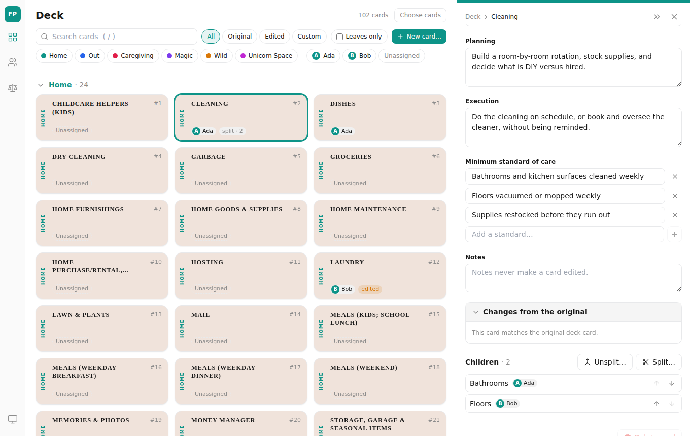
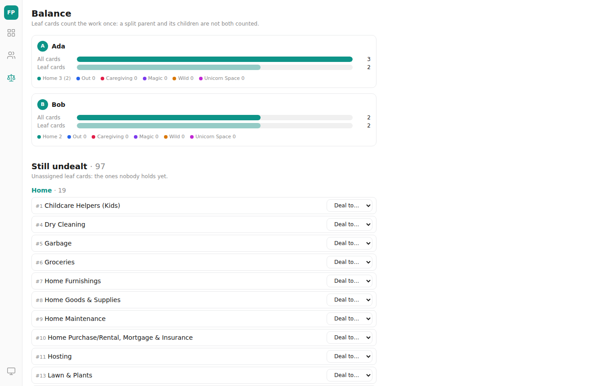
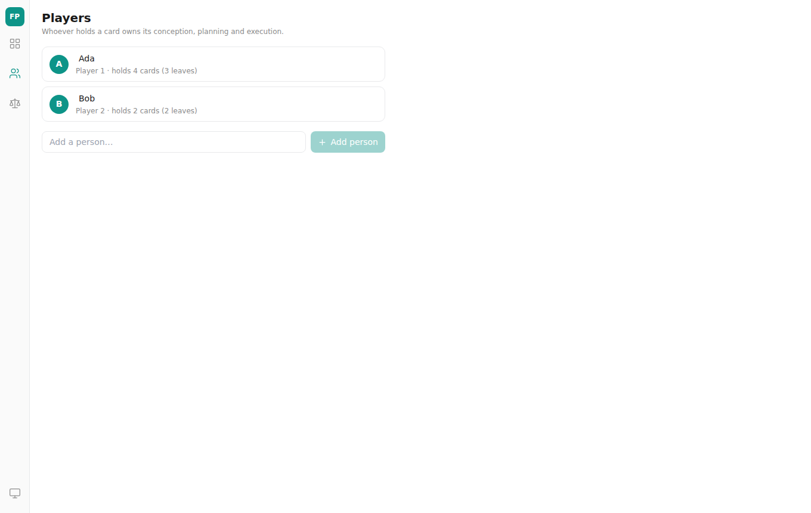
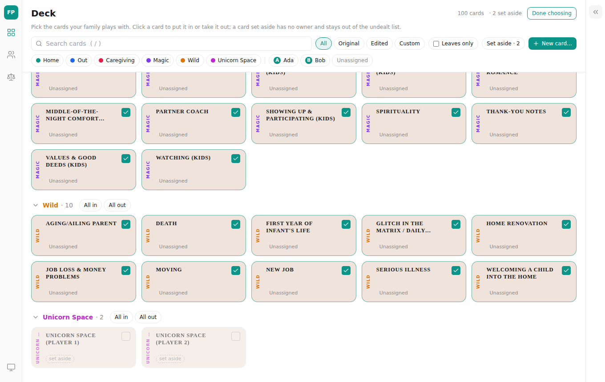

# Fair Play — web UI for `rusty_fair_play`

React 18 + TypeScript + Vite + Tailwind + Zustand + React Router (hash routes),
the same tooling as `crates/apps/rusty_tick/web`. Talks to the `rusty_fair_play`
server (data lives in `rusty_multimodal_db`'s `fair_play` domain, ADR-0137), or
runs alone against an in-browser demo backend.



## Run it

```sh
cargo build -p rusty_fair_play   # from the repo root; the binary the tests below start
npm ci
npm run dev                      # http://localhost:5173, proxies /api and /health to $FAIR_PLAY_BACKEND (default 127.0.0.1:8790)
npm test                         # unit/component tests (jsdom, in-memory backend) incl. the API contract against MemoryAdapter
npm run test:integration         # the same API contract against the real rusty_fair_play binary
npm run build                    # typecheck + production bundle into dist/
npm run e2e                      # Playwright flows against the real binary serving dist/ from a fresh .e2e-data; also takes the screenshots
```

Serve it for real with `target/debug/rusty_fair_play --data-dir ./data --web-dir web/dist`
and open `http://127.0.0.1:8790/`. The deck ships in the binary and is loaded on
first start, so the board is full straight away. The UI boots without asking for
anything; if the server was started with `RUSTY_FAIR_PLAY_TOKEN`, the first `401`
brings up the token prompt (kept in sessionStorage, or localStorage with
"remember on this device"). Demo mode: open `/?adapter=memory` — the full
hundred-card deck (parsed from the same CSV the binary embeds) in the browser's
localStorage, nothing sent anywhere.

## What it does

- `#/deck` — the board: six suit shelves in deck order with counts, a tile per
  card (suit stripe, number, name, owner chip, `edited`/`custom`/`split · N`
  badges). Filter by suit, owner, state, leaves only, and name; `/` focuses search.
  "New card…" makes a custom top-level card (`POST /cards`) and opens it.
- `#/deck/:cardId` — the detail pane (a drawer over the board on narrow screens):
  breadcrumb up the split chain, inline rename, "Deal to…", Conception /
  Planning / Execution, the minimum standard of care as an editable list, notes —
  plus Suit and Parent selects (the parent list leaves out the card and what is
  under it). One Save sends only the changed fields in one `PATCH`. Deck cards get a
  "Changes from the original" disclosure (field-by-field diff from `/baseline`)
  and a confirmed "Reset to original"; custom cards say so. Children are listed in
  position order with move up/down (one `PUT /cards/{id}/children/order`), a
  "Split…" dialog (child rows with owners, and whom to hand the parent to), a
  confirmed "Unsplit…" (removes the whole subtree, says how many cards) and a
  confirmed "Delete card" (leaves only; disabled with the reason while it has children).
- **The family's deck.** Families play with the cards they choose. The detail pane
  has an "In our deck" checkbox (it asks first when the card is dealt, since setting
  it aside takes it back from its owner), and the board's **Choose cards** mode shows
  every card as a checkbox tile with "All in" / "All out" per suit. A "Set aside · N"
  chip shows only the cards left out, to bring them back. The board, the undealt list
  and the balance count only the cards in play.
- **Layout.** Every tile is the same size (two lines of name at most, the full name on hover), styled after the printed deck: a blush-cream card, the name in spaced serif capitals, the suit up the left edge. The detail pane
  folds to a thin rail with its »/« button, remembered across reloads, and opening a
  card brings it back.
- `#/players` — people with "holds N cards (M leaves)", inline rename, add (a
  `409` shows as "already exists"), and a confirmed remove, disabled while they hold a card.
- `#/balance` — per person, all-cards and leaf-only bars with a per-suit row, then
  "Still undealt": the unassigned leaf cards grouped by suit with a quick deal.

## How it fits together

- `src/api/` — one `ApiClient` interface, two adapters: `HttpAdapter` (`/api/v1`,
  same origin) and `MemoryAdapter`, which keeps the same rules in the browser
  (state derived against a kept baseline, splits with positions, reset, unknown
  owner and cycle refusals, 409 on a duplicate name). `contract.ts` is one
  behaviour suite run against both (`npm test` and `npm run test:integration`).
- `src/store/data.ts` — a Zustand store holding the snapshot; writes await the
  server and merge the returned card(s) in; the snapshot is refreshed on window
  focus and every 30 s. Reads and writes are ordered: a snapshot requested before
  a write started (or still in flight when one finished) is dropped, and an older
  read never replaces a newer one, so a slow refresh cannot roll back a save or
  hide a new card. A write to a card with an ancestor is followed by a re-read so
  the ancestors' `treeEtag`s match the server. `derive.ts` computes children, leaves, chains, balance
  (all vs leaf-only) and counts from the cards array on the client.
- `src/features/` — deck (board, filters, detail pane, split dialog, baseline
  block), players, balance. `src/components/` — Dialog, Confirm, Toasts, Tooltip,
  the rail, badges. `src/styles/tokens.css` — every colour as a CSS variable,
  including the six suit colours, with a dark set under `[data-theme="dark"]`
  (the rail's theme button cycles system / light / dark).

| | |
|---|---|
|  |  |
|  | |

## Concurrent edits

Every card write sends `If-Match` with the version it was based on: the draft's
own `etag` for an edit (fixed when the user starts typing, not re-read at save),
the card's `etag` for deal, rename, split, reset and delete, and its `treeEtag`
for unsplit and child reorder, which also moves when a descendant is edited,
added or reordered.

- A save the server refuses (`412`) keeps the draft, merges the newer card in and
  toasts. The pane then shows a notice with **Overwrite** (save on top of the new
  version) and **Discard mine**.
- A refresh that brings in a newer card while a draft is pending shows the same
  notice before any save, and there is no quiet Save: it is an Overwrite.
- Fields the user has not touched follow the card; fields typed while a save is in
  flight are kept, not reset by the answer.
- The check is per card, not per field: editing a different field of a card
  someone else just saved is still a conflict, and Overwrite replaces only the
  fields the user changed.

## Limits

- A child reorder is one request, validated whole before anything is written, but
  the server then writes each child's position separately. It is not crash-atomic:
  a crash part way leaves some positions applied (equal positions fall back to id
  order). A failed request leaves the UI as it was.
- Without `If-Match` the API is last-writer-wins; this UI always sends it, other
  clients may not.
- Deleting a deck card removes it for good until `POST /seed` (not done on start-up
  once the deck has loaded) restores the missing ones.
