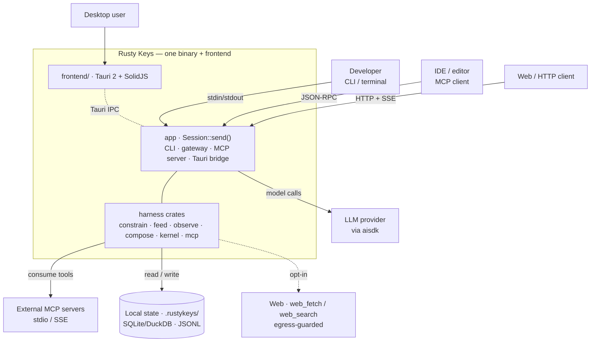
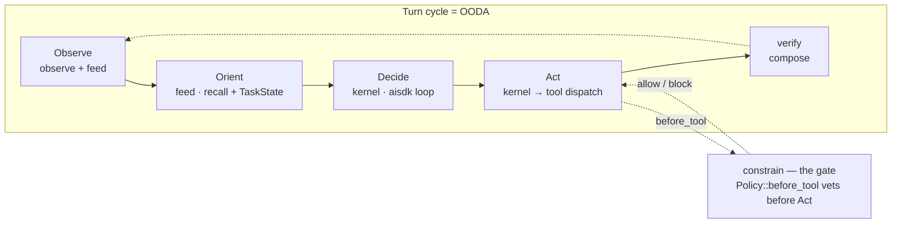
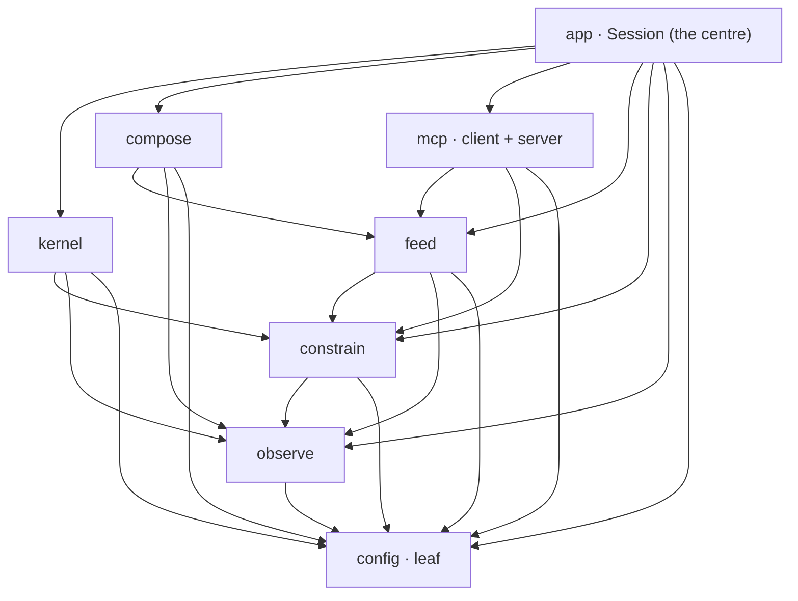
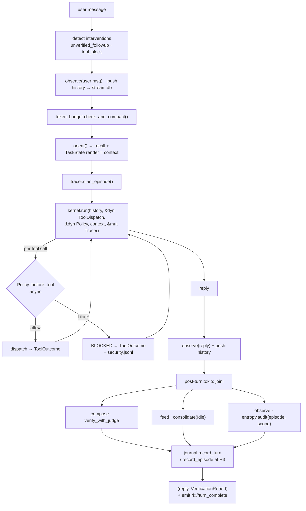
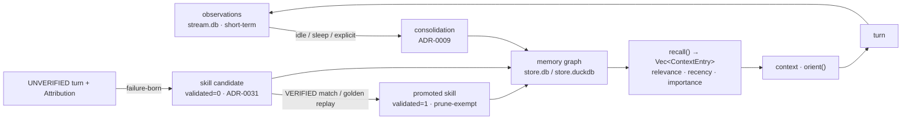
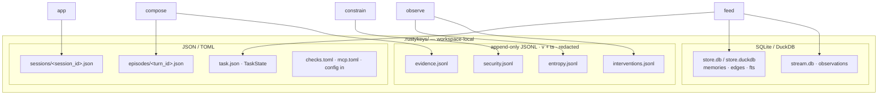
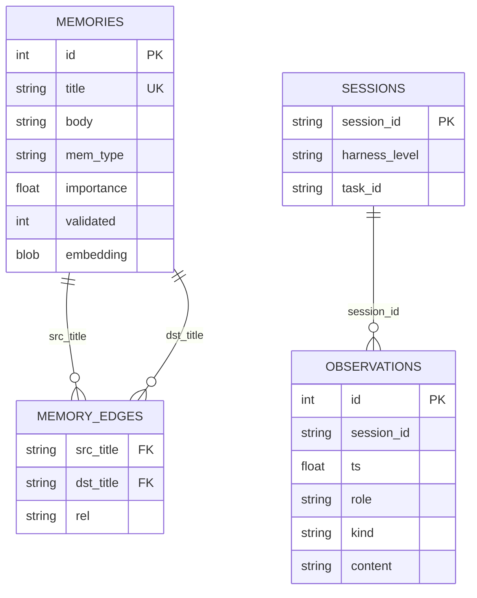
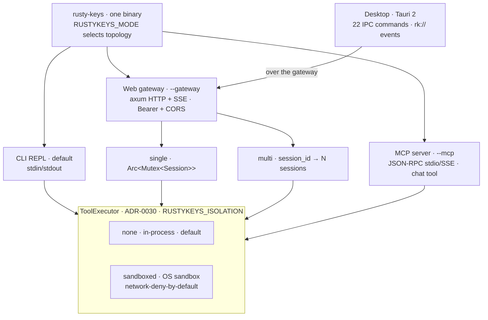
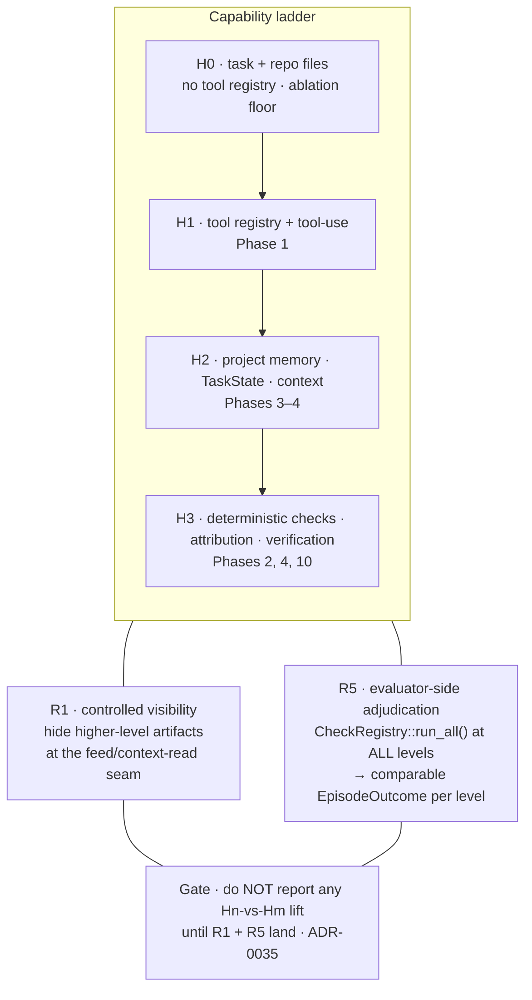

# Rusty Keys — architecture & plan, at a glance

> **What this is.** A diagram-first entry point for implementers: the system in pictures, tied to the
> development plan. It **synthesizes and links** the authoritative docs — it does not restate them.
> If anything here disagrees with the source-of-truth docs, **they win**:
> [`ARCHITECTURE.md`](./ARCHITECTURE.md) (system structure) ·
> [`architecture/data-model.md`](./architecture/data-model.md) (on-disk schemas) ·
> [`../BACKLOG.md`](../BACKLOG.md) (the phased plan) ·
> [`prd/`](./prd) (per-component depth) · [`adr/`](./adr) (decisions).

---

## 1. System context

One Rust binary (plus an optional Tauri desktop frontend) sits between its users and four external
dependencies: the LLM provider (reached through `aisdk`), external MCP servers, the local `.rustykeys/`
state, and — opt-in, egress-guarded — the web.

**SSOT:** [`ARCHITECTURE.md` §1–§2](./ARCHITECTURE.md), [§9 deployment](./ARCHITECTURE.md).

---

## 2. The four verbs on the OODA loop

The harness is decomposed into four verbs mapped onto OODA; the kernel is deliberately thin (it knows
nothing about memory, policy, or verification). `constrain` is the gate that vets **every** tool call
before it acts.

| Verb | OODA | Crate | Owns |
|---|---|---|---|
| **Constrain** | gate | `constrain` | tool-call vetting, permission modes, security checkers, approval |
| **Feed** | Observe+Orient | `feed` | tools, memory, TaskState, context assembly |
| **Observe** | Observe | `observe` | episode trace, interventions (M-HIR), entropy |
| **(Kernel)** | Decide+Act | `kernel` | the aisdk agent loop |
| **Compose** | verify | `compose` | verification, attribution, evidence, episode packages |

**SSOT:** [`ARCHITECTURE.md` §2](./ARCHITECTURE.md), [`adr/0005`](./adr/0005-harness-decomposed-into-four-verbs.md), [`reference/glossary.md`](./reference/glossary.md).

---

## 3. Components — eight crates + a frontend

Acyclic by construction. `app` is the only binary and wires everything; `kernel` receives the tool
registry and policy as **trait objects** (`&dyn ToolDispatch` / `&dyn Policy`) so it never imports
`feed` or `compose`. The full edge set and import contract is the authoritative DAG in `ARCHITECTURE.md` §5.

> Cross-crate cycle avoidance: the `agent` subagent tool lives in `feed` but must build a child
> `Session` (in `app`) — resolved by the `SessionFactory` trait `app` injects ([`adr/0017`](./adr/0017-subagent-spawning-via-sessionfactory-trait.md)).

**SSOT:** [`ARCHITECTURE.md` §4–§5](./ARCHITECTURE.md).

---

## 4. Runtime — the turn cycle as data flow

`Session::send()` owns the cycle; adapters are thin transports. This is the data-flow companion to the
sequence diagram in `ARCHITECTURE.md` §6.

**SSOT:** [`ARCHITECTURE.md` §6–§7](./ARCHITECTURE.md), [`prd/06-app.md`](./prd/06-app.md), [`adr/0012`](./adr/0012-post-turn-compose-runs-concurrently.md).

### 4a. Memory lifecycle

Short-term observations consolidate (idle/sleep/explicit) into the long-term graph; `recall()` scores
and returns structured entries that feed `orient()`. Failure-born skills are **candidates** until
validated (ADR-0031) before they become prune-exempt.

**SSOT:** [`prd/03-feed.md`](./prd/03-feed.md), [`adr/0008`](./adr/0008-memory-is-observe-orient-half-of-ooda.md)/[`0009`](./adr/0009-tiered-consolidation-idle-sleep-explicit.md)/[`0011`](./adr/0011-skills-exempt-from-pruning.md)/[`0031`](./adr/0031-validation-gated-skill-promotion.md).

### 4b. Episode-package assembly (H3)

At H3, the **assembly projector** (ADR-0036) is the named builder that projects raw evidence into the
eight typed traces — so no trace ships without a producer.

```mermaid
flowchart LR
    subgraph rawev["raw evidence"]
      stream["stream.db observations"]
      outcomes["ToolOutcomes"]
      recallout["recall() output"]
      checkres["CheckResults"]
      interv["interventions.jsonl"]
    end
    asm["EpisodeAssembler<br/>compose-time projector · ADR-0036"]
    rawev --> asm
    subgraph traces["8 typed traces"]
      t1["action_trace · ActionEvent"]
      t2["tool_trace · +exit_code/timeout/recovered"]
      t3["context_trace · ContextEntry"]
      t4["verification_trace · VerifyEntry · covers[]"]
      t5["attribution_log · FailureType"]
      t6["reproduction_log"]
      t7["verification_report"]
      t8["intervention_log · per-turn filtered"]
    end
    asm --> traces
    traces --> pkg["EpisodePackage<br/>episodes/&lt;turn_id&gt;.json + EpisodeOutcome"]
```

**SSOT:** [`data-model.md` §5–§5.1](./architecture/data-model.md), [`adr/0036`](./adr/0036-episode-package-assembly-projector.md), [`prd/05-compose.md`](./prd/05-compose.md).

---

## 5. Data & on-disk state

All state is workspace-local under `.rustykeys/`; every path is `RUSTYKEYS_*`-overridable. The diagram
below shows **which crate owns each artifact** (`checks.toml`/`mcp.toml` are read-only config inputs).

Logical view of the stores (separate DBs — no cross-DB FKs; `sessions/` is JSON, shown for lineage):

**SSOT:** [`data-model.md`](./architecture/data-model.md) (every schema, serde, versioning, durability), [`reference/configuration.md`](./reference/configuration.md), [`adr/0027`](./adr/0027-on-disk-schema-versioning.md).

---

## 6. Deployment topologies

One binary; `RUSTYKEYS_MODE` selects the transport. Every vetted side-effect runs through a
`ToolExecutor` (ADR-0030) whose profile (`none` default, or `sandboxed`) is orthogonal to the mode.

**SSOT:** [`ARCHITECTURE.md` §9–§10](./ARCHITECTURE.md), [`adr/0030`](./adr/0030-capability-isolation-toolexecutor.md), [`prd/07-mcp.md`](./prd/07-mcp.md), [`prd/08-frontend.md`](./prd/08-frontend.md).

---

## 7. H0–H3 maturity & the controlled-visibility ablation

The ladder is **additive in capability** but must become a **controlled-visibility ablation** before any
cross-level claim is trustworthy: **R1** hides higher-level artifacts at the feed/context-read seam
(existence, not authority), and **R5** adjudicates every level evaluator-side.

**SSOT:** [`ARCHITECTURE.md` §3](./ARCHITECTURE.md), [`adr/0035`](./adr/0035-controlled-visibility-ablation-eval-substrate.md), [`adr/0028`](./adr/0028-h0-selectable-harness-level-or-eval-only.md), [`dev/eval-plan.md`](./dev/eval-plan.md).

---

## 8. Development plan — phases, crates, issues

Each phase is a **working, runnable system**, dependency-sequenced. The full dependency graph,
Definition-of-Done, acceptance criteria, test gates, and risks live in
[`../BACKLOG.md`](../BACKLOG.md); the GitHub issue for each item carries the working state. The
**engineering substrate** (error model, `ToolOutcome`, `async before_tool`, `FakeLanguageModel`, CI,
`KernelEvent`, on-disk versioning) lands **with Phase 1** and is intentionally issue-less.

| Phase | Goal (maturity) | Primary crate(s) | Size | Issues |
|---|---|---|---|---|
| 1 | Runnable skeleton (H1) | config · observe · constrain · feed · kernel · app | L | #1–#7 |
| 2 | Observe + Compose (H3-deterministic) | observe · compose | M | #36 |
| 3 | Memory (H2) | feed | L | #37 |
| 4 | Task State + semantic verification (H2/H3) | feed · compose | M | #38 |
| 5 | DuckDB + embeddings | feed | M | #39 |
| 6 | Full tool suite | feed | L | #8–#11 |
| 7 | Permission system | constrain | M | #14 |
| 7B | Capability isolation (ToolExecutor) | constrain · feed | L | #40 |
| 8 | Token & context management | kernel · app | M | #15 |
| 9 | Plan mode | app · feed | S | #16 |
| 10 | H3 episode packages | observe · compose | L | #21 · **#42** (projector) · **#41** (ablation) |
| 11 | Entropy auditor | observe | M | #19 |
| 12 | MCP integration | mcp | L | #12 · #13 |
| 13 | Extended CLI | app | M | #20 |
| 14 | Web gateway | app | M | #18 |
| 15 | Desktop frontend | frontend/ | XL | #22–#27 |
| cross-cutting | Eval-integrity guard | compose · observe | M | #43 |
| post-phase | Rich terminal UI (ratatui) | app | — | #17 |

**Critical path:** Phase 1 → {2, 3, 6} → 4 → {10, 11}; 7 → 7B and 7 → 9 → ...; 14 → 15. See the
[dependency graph in `BACKLOG.md`](../BACKLOG.md#phase-dependency-graph).

---

## 9. Where to go next

| You want… | Read |
|---|---|
| System structure, concurrency, faithfulness map | [`ARCHITECTURE.md`](./ARCHITECTURE.md) |
| Exact on-disk schemas, serde, versioning | [`architecture/data-model.md`](./architecture/data-model.md) |
| Threat model & redaction | [`architecture/threat-model.md`](./architecture/threat-model.md) |
| The phased plan (DoD/AC/gates/risks) | [`../BACKLOG.md`](../BACKLOG.md) |
| Per-component design | [`prd/`](./prd) (00 overview → 08 frontend) |
| Why a decision was made | [`adr/`](./adr) (0001–0036) |
| Errors, testing, eval, standards | [`dev/`](./dev) |
| Env vars & config | [`reference/configuration.md`](./reference/configuration.md) |
| Vocabulary | [`reference/glossary.md`](./reference/glossary.md) |
