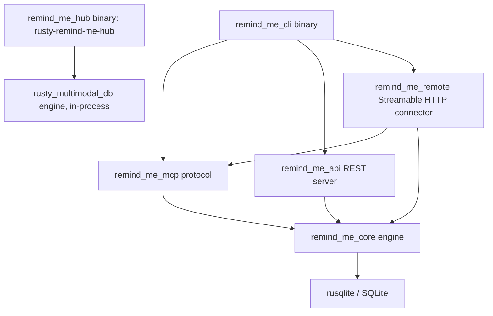

# Architecture & System Design

This document details the architectural principles, data flow, mathematical scoring models, database schema, and crate boundaries of `rusty_remind_me`.

---

## 1. System Design Goals

`rusty_remind_me` is designed as a **high-performance, zero-overhead persistent memory engine** for AI agents.

Key Architectural Tenets:
1. **Predictable Performance**: Microsecond-level SQLite FTS5 query latency and zero runtime Garbage Collection pauses.
2. **Minimal, Call-Site-Justified Dependencies**: No dependency is declared
   speculatively. (This project once aspired to a "Rusty Mill" ecosystem of
   shared crates — `rusty_tokio`, `rusty-db`, `rusty_json`, `rusty-search`,
   `rusty_http`, and others — declared as path dependencies against a
   monorepo that never existed at those paths; the workspace failed to load,
   and not one source file actually called into any of them. They were
   removed. See the "Rusty Mill ecosystem dependencies" comment in the
   workspace `Cargo.toml` for the full account, and re-adopt one only at the
   point it gains a real call site.)
3. **Wire compatibility, not file sharing** (*replaced 2026-09-26*). This tenet used to be "Data Parity with `remind-me`": an identical SQLite v29 schema so the Python `remind_me` and this port could open the same `memory.db`. The Python reference is retired (ADR-0023), so the node's storage is its own. What stays compatible is the **sync protocol**: nodes, peers and the hub exchange records in the same wire format, whatever each stores them in. The MCP tool names and signatures stay as they are, because clients rely on them, not because Python does.
4. **Thread Safety**: Thread-safe database access using `Arc<Database>` wrapped in `parking_lot::Mutex<rusqlite::Connection>`, safe for concurrent access from plain OS threads — the scheduler, folder watcher, sync worker and promotion nudge are each `std::thread::Builder::spawn` loops, not `tokio` tasks; `remind_me_remote` is the one crate in this workspace that runs on `tokio` (§2).

---

## 2. Workspace & Crate Boundaries



`remind_me_hub` is its own binary (`rusty-remind-me-hub`), not reached
through the `remind_me_cli` dispatch and not a build dependency of
`remind_me_core` or vice versa — it is the central sync point nodes push to
and pull from over HTTP, sharing a wire protocol with `remind_me_core::sync`
rather than a crate dependency. The one Cargo edge between them runs the
other direction and only in tests: `remind_me_core`'s `dev-dependencies` path
to `remind_me_hub` (without the copy tool's Postgres reader,
`default-features = false`) lets
`tests/support`'s `MockHub` exercise real `remind_me_hub` request handling
without a spawned process.

### Crate Roles
- **`remind_me_core`**: The domain core containing:
  - Database schema creation & migrations (`db/schema.rs`, `db/queries.rs`).
  - ACT-R Memory Vitality calculation engine (`vitality.rs`).
  - Hybrid Search Engine & RRF rank fusion algorithm (`retrieval.rs`).
  - Entity Knowledge Graph management (`entity.rs`).
  - Markdown Wiki compilation (`wiki.rs`).
  - Markdown directory import into the wiki (`wiki_import.rs`) — YAML front
    matter parsing with per-field fallbacks, idempotent upsert on `slug`.
  - Adapters for the optional features (`pdf_import.rs`, `image_import.rs`,
    `audio_import.rs`, `cloud_backup.rs`, `ann_index.rs`, `reranker.rs`, and
    `embedder.rs`'s `onnx_backend`), each behind its own Cargo feature and
    off by default. They are ~5% of the crate but force all of it to
    recompile per enabled feature; `docs/adr/0018` records why they stay
    here anyway, and the triggers that should change that answer.
  - This crate is by far the largest — roughly six times the next one — and
    everything else in the workspace depends on it. That concentration is
    the workspace's main structural liability; `docs/adr/0018` covers what
    was considered and rejected, including splitting it by domain.
- **`remind_me_mcp`**: The Model Context Protocol layer handling:
  - Stdio JSON-RPC protocol loop (`initialize`, `tools/list`, `tools/call`).
  - Input payload validation & error formatting.
- **`remind_me_api`**: The REST API layer:
  - Synchronous HTTP daemon hand-rolled on `std::net::TcpListener` — no
    framework, not even `tokio` (matches this workspace's tenet 2: the
    project's aspirational `rusty_http` dependency was never real; see
    above).
  - Routes span far beyond `/health`. `crates/remind_me_api/src/routes.rs`'s
    `ROUTES` table is the current, authoritative route inventory — this
    document does not duplicate it for the same reason §5 stopped duplicating
    the schema DDL. What the table covers, by family rather than by route:
    memories (CRUD, search, bulk operations), entities and graph traversal,
    the wiki (read, search, load, write, delete, compile, schema, status),
    reminders, saved searches, the daily digest, subsystem status, memory
    version history, stats/vitality/analytics-trend reporting, import/export,
    and the health/metrics/manifest/dashboard endpoints.
  - The write surface is wider than memories, which is why the families are
    worth naming here at all: the wiki, reminders and saved searches are all
    mutable over HTTP. Every mutating method (`POST`/`PUT`/`PATCH`/`DELETE`)
    is refused with 401 while `REMIND_ME_API_KEY` is unset, so growing that
    surface never defaults open. `crates/remind_me_api/src/lib.rs`'s module
    doc is the authoritative statement of the auth posture — including what
    happens once a key *is* set, the `/health` carve-out, and read-scoped
    keys — and is not restated here.
- **`remind_me_cli`**: The unified CLI binary executable (`rusty-remind-me`) handling command line flags and subcommand dispatch (`server`, `api`, `remote`, `configure`, `add`, `search`, `get`, `entity`, `wiki-write`, `wiki-read`, `wiki-import`, `stats`).
- **`remind_me_remote`**: The Streamable HTTP MCP connector, on `tokio` + `axum` + `rmcp` (the one place this workspace takes on that async stack — every other crate stays synchronous, a deliberate boundary; see `crates/remind_me_remote/src/lib.rs`'s module doc):
  - Secret-path/bearer auth (FT-05) and, when an issuer is configured, a hand-rolled OAuth 2.1 authorization server (FT-07, `docs/adr/0011`).
  - `RemindMeHandler` adapts `remind_me_mcp::McpServer::handle_request` (synchronous) to `rmcp`'s async `ServerHandler` trait via `spawn_blocking`, rather than reimplementing tool/resource/prompt dispatch.
- **`remind_me_hub`**: The central multi-node sync server (`rusty-remind-me-hub` binary) speaking the same push/pull peer protocol `remind_me_core::sync` serves node-to-node, storing its data in the embedded `rusty_multimodal_db` engine (`docs/adr/0021`); its Postgres and SQLite stores (`docs/adr/0015`) are retired, and `rusty-remind-me-hub-copy` moves an old hub onto the engine. A hub never pulls; nodes push to and pull from it.

---

## 3. Core Data Flow

### A. Write Path (`remind_me_add` / `add_memory`)
```
Input (MemoryAddInput)
  │
  ├──► Calculate Decay Rate (get_decay_rate based on category)
  ├──► Calculate Type Prior (get_type_prior) & Source Prior (get_source_prior)
  ├──► Compute Initial Vitality Score (calculate_vitality)
  ├──► Generate Unique Memory ID (UUID v4: mem_...)
  │
  ▼
SQLite Database (`memories` table)
  │
  └──► Automatic SQLite Trigger (`memories_ai`)
         │
         ▼
       SQLite FTS5 Index (`memories_fts`)
```

### B. Read & Search Path (`remind_me_search` / `search_memories`)
```
Search Input (MemorySearchInput query, category, limit, min_vitality)
  │
  ├──► Query Shape Heuristic Router (looks_keyword_shaped, looks_semantic_shaped, looks_temporal_shaped)
  ├──► RRF Weight Selection (choose_rrf_weights)
  │
  ├──► Execute SQLite FTS5 Match Query (bm25 ranking)
  ├──► Filter Dormant Memories (vitality < 0.05 or min_vitality threshold)
  │
  ├──► Execute Reciprocal Rank Fusion (rank_rrf) over five signals (§4B)
  │
  ├──► Trim by Token Budget (trim_by_token_budget)
  │
  ▼
Returned Search Results (Vec<MemorySearchResult>)
```

---

## 4. Mathematical Models

### A. ACT-R Vitality Decay Model
The memory retention score follows an exponential decay formula inspired by the ACT-R cognitive architecture:

$$\text{Vitality} = \text{Base Weight} \times \sqrt{\text{Access Count} + 1} \times e^{-\text{Decay Rate} \times \text{Days}}$$

Key Parameters:
- **Base Weight**: Product of category prior ($\text{Decision}=1.3$, $\text{Fact}=1.15$, $\text{Action Item}=1.0$) and source prior ($\text{Manual}=1.0$, $\text{Import}=0.85$).
- **Bridge Protection**: When $\text{Access Count} \ge 10$, the effective decay rate is halved ($\text{Decay Rate} \times 0.5$) to simulate consolidation into long-term memory.
- **Dormancy Floor**: Memories with $\text{Vitality} < 0.05$ are flagged dormant and excluded from standard search results.

### B. Reciprocal Rank Fusion (RRF)
Search candidates are fused across **five** signals — keyword/FTS, semantic,
recency, vitality, and IDF (BM25-based) — not just keyword and vitality:

$$\text{RRF Score}(m) = \sum_{s \in \text{Signals}} \frac{w_s}{K + \text{Rank}_s(m)}$$

Where $K = 60$ (`RRF_K_DEFAULT`) by default, overridable via
`REMIND_ME_RRF_K`; each signal's weight is independently overridable too
(`REMIND_ME_RRF_W_KEYWORD`/`_SEMANTIC`/`_RECENCY`/`_VITALITY`/`_IDF`). `rank_rrf`
(`crates/remind_me_core/src/retrieval.rs`) also supports a `Score` fusion mode
(min-max normalized) alongside the rank-based one shown here, selected via
`REMIND_ME_RRF_FUSION` — that file is the source of truth for the exact
per-signal weighting and mode selection, not reproduced further here for the
same reason §5 stopped reproducing the schema DDL.

---

## 5. Database Schema Specification (Version 29)

The schema lives in `crates/remind_me_core/src/db/`: `schema_tables.sql`,
`schema_indexes.sql` and `schema_triggers.sql`. They were dumped verbatim from
the Python `remind_me` at `_SCHEMA_VERSION = 29`, while the two shared a
database file (ADR-0007). That reference is retired (ADR-0023), so the files
are hand-owned now. `db/migrations.rs` reconciles any database it opens against
them and stamps `PRAGMA user_version` (`SCHEMA_VERSION` in `db/migrations.rs`;
check that constant directly rather than trusting this number to stay current).

The node's storage is moving off SQLite altogether (ADR-0023): these files
describe the store until that switch, not the store's future.

This section used to reproduce the `CREATE TABLE` statements inline. It no
longer does: a hand-maintained copy of the DDL drifts, and drifts silently.
The copy that was here had gone stale in exactly that way — it still showed
`last_accessed_at` (renamed to `accessed_at`), an `entities` table with no
`node_id`, `memory_entities` with cascading foreign keys, and a
`wiki_pages.topic` column — four shapes the schema tests now assert are
*wrong*.

### Where to look instead

| For | Read |
| --- | --- |
| The exact current DDL | `crates/remind_me_core/src/db/schema_*.sql` |
| How an existing database is brought to it | `db/migrations.rs` (module docs: reconciliation, not a ladder) |
| Where the schema came from | ADR-0007, and ADR-0023 for why it is hand-owned now |
| Whether an open database matches it | `crates/remind_me_core/tests/schema_test.rs` — compares every table, index and trigger by normalised DDL |

### Objects this crate adds beyond the schema files

A few, deliberately, created by the code that owns them rather than by the
files: `vec_embeddings` (vector bytes;
`docs/adr/0002-embeddings-ollama-and-brute-force-vectors.md`), the import
archive tables (`archive.rs`) and `promotions` (`promotion.rs`). They were kept
out of the files while those were generated from Python. `schema_test.rs`'s
`OWN_ADDITIONS` is the allowlist, and anything not on it that appears in a live
database fails the schema test.

### Notes that outlive the DDL

`wiki_pages.slug` being the primary key is what makes `wiki-import`
(`wiki_import.rs`) idempotent: `write_wiki_page` upserts, so re-importing a
regenerated directory revises pages in place. `content` stores the Markdown
body *after* front matter — the fields front matter carries are columns here,
so retaining them in the body would duplicate them and leak YAML into anything
that renders the page.

---

## 6. Concurrency & Thread Safety Model

To allow safe concurrent access from the plain OS threads this workspace
actually uses — CLI subcommand processes, the MCP stdio loop, and the
scheduler/watcher/sync-worker/promotion-nudge background threads (each a
`std::thread::Builder::spawn` loop, not a `tokio` task; see §1 tenet 4)
— without lock contention or data races:
- The `Database` struct wraps `rusqlite::Connection` in
  `parking_lot::Mutex<Connection>`, not `std::sync::Mutex` — `parking_lot`'s
  `lock()` returns the guard directly rather than a `LockResult`, since this
  codebase has no use for poisoning semantics.
- Calling `db.conn()` returns a `MutexGuard<'_, Connection>`, which derefs to `&rusqlite::Connection`.
- Automatic SQLite WAL (Write-Ahead Logging) journal mode (`PRAGMA journal_mode=WAL`) and busy timeouts (`PRAGMA busy_timeout=30000`) enable high-concurrency readers and sequential writers.
