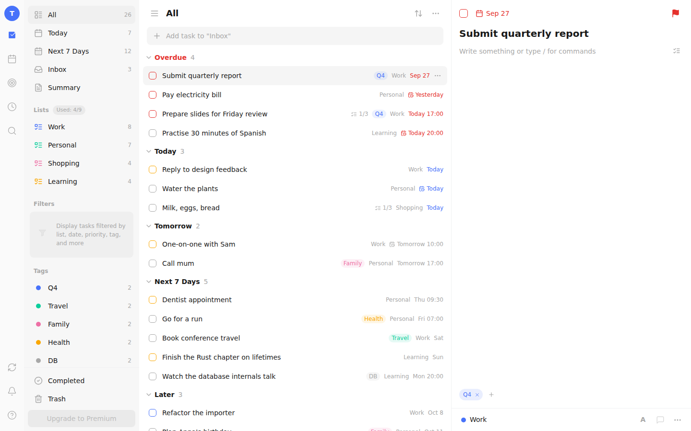
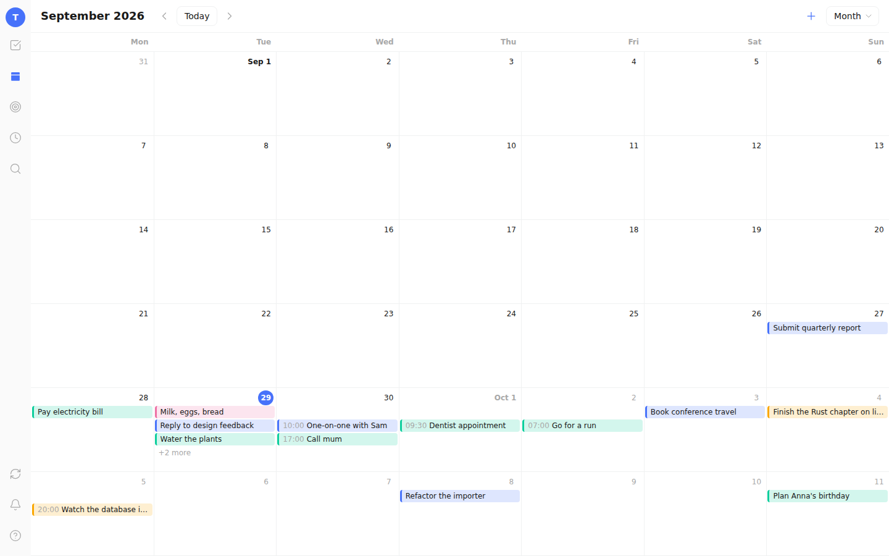
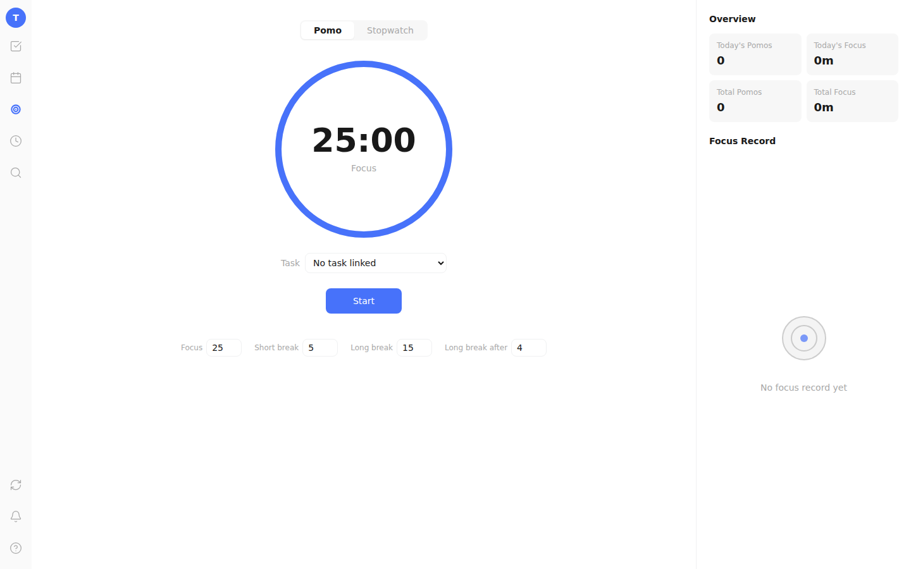
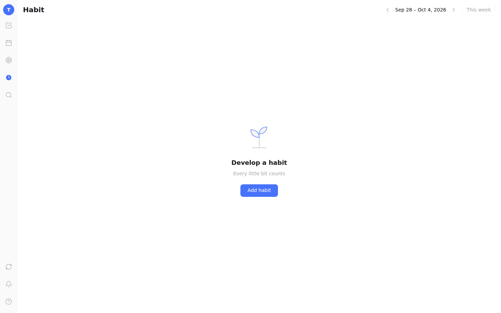
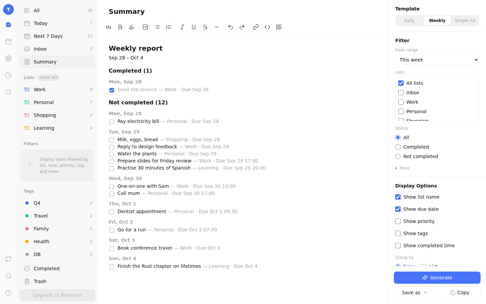

# Tick Local — web UI for `rusty_tick`

React 18 + TypeScript + Vite + Tailwind + Zustand + React Router (hash routes).
Talks to the `rusty_tick` server (data lives in `rusty_multimodal_db`), or runs
alone against an in-browser demo backend.



## Run it

```sh
npm ci
npm run dev                # http://localhost:5173, proxies /api to $TICK_BACKEND (default 127.0.0.1:8787)
npm test                   # 540+ unit/component/integration tests (jsdom, in-memory backend)
npm run test:integration   # same API contract against the real rusty_tick binary (cargo build -p rusty_tick first)
npm run e2e                # Playwright flows against the real binary (single-user and per-user tokens); needs `cargo build -p rusty_tick` and `npm run build` first; also runs in CI
npm run build              # typecheck + production bundle into dist/
```

Server mode: start `RUSTY_TICK_TOKEN=<16+ chars> rusty_tick --data-dir ./data --web-dir web/dist`,
open the URL, choose *Connect to server*, and enter the token (kept in
sessionStorage unless you tick "remember"). With per-user tokens (`rusty_tick user add`, ADR-0002) paste the full `<user>.<secret>` token; cached data is kept per user and dropped when another user signs in or the user signs out. Demo mode: choose *Try the demo*, or open `/?adapter=memory`.

## How it fits together

- `src/api/` — one `ApiClient` interface, two adapters: `MemoryAdapter` (same rules as the Rust service) and
  `HttpAdapter` (`/api/v1`). A single contract suite (`contract.ts`) runs against both.
- `src/store/` — Zustand store: server "base" state plus a persisted queue of pending operations replayed over it.
  Writes are optimistic, retried with backoff when offline, and retried once on `412` (etag).
- `src/features/` — tasks (list, kanban, detail pane, date popover), lists/tags, search, calendar, focus, habits, summary, settings.
- `src/components/` — Popover, Menu, Dialog, Confirm, Tooltip, toasts: keyboard-operable and labelled.

| | |
|---|---|
|  |  |
|  |  |

## Where this differs from the prompt (deliberately)

The prompt's selections (database, HTTP stack) are fixed by the backend, so the UI follows our API, not TickTick's:

- Ids are client-generated UUIDs and times are epoch milliseconds (not 24-hex ids / ISO strings); task status is `open | done`.
- No TickTick batch API and no WebSocket "needSync": the UI polls and refreshes on window focus.
- Focus records, habits, check-ins, comments and the summary template are stored as generic `docs` in the backend, so they sync like everything else.

## Stubs and known gaps

- Reminders: task and habit reminders show as browser notifications while a tab is open (Settings → Notifications, opt-in). Firing with the app closed needs Web Push (a push service and VAPID keys), which conflicts with staying self-contained; it is not planned.
- Premium: the upgrade bar and menu entry are disabled; the "Used n/9" list counter is cosmetic (not enforced).
- Settings: Account, Notifications, Date & Time, Appearance, Shortcuts and About are real; the other seven tabs are placeholders.
- Comments are `comment` docs; a task's comments are deleted when the task is purged (they survive the Trash, so a restore loses nothing). Import Backups adds what a backup lacks (habits and comments are not in a backup); Delete All Data empties the account but keeps the sign-in — there is no account deletion.
- Search modal has no footer; the sort menu adds a "Custom" option for manual order.
- Calendar: later occurrences of repeating tasks are shown faded and cannot be dragged; the agenda has no drag; "+N more" lists all of the day's tasks.
- Habits: a check-in means "done" (the goal amount is text).
- Sync is by polling every 30 s and on window focus. A push channel would need a streaming endpoint and a service worker, which the self-hosted server does not have; it is not planned.
- Compared by eye against screenshots of the real app (not pixel-diffed); differences that remain are listed in the pull requests that closed the gap.
