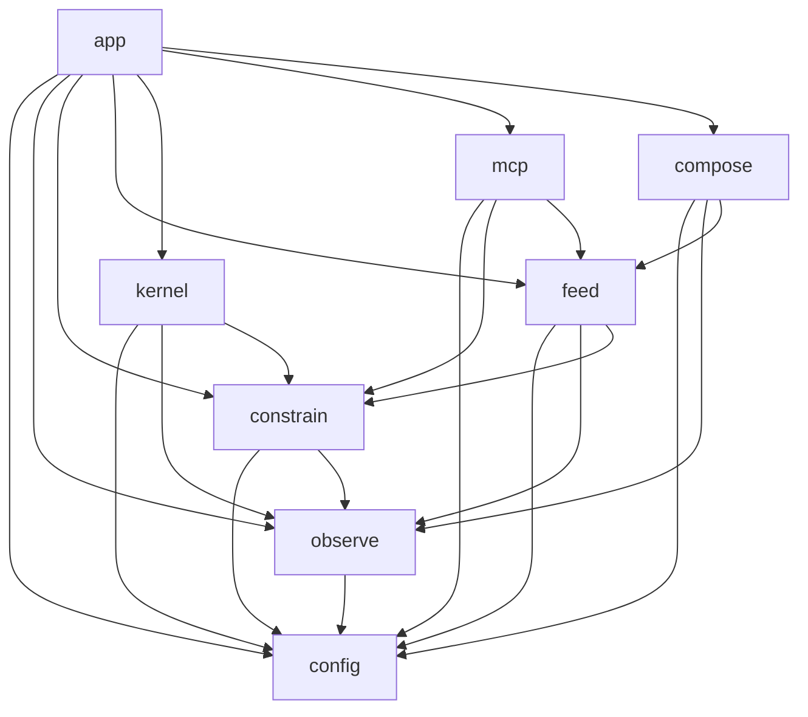
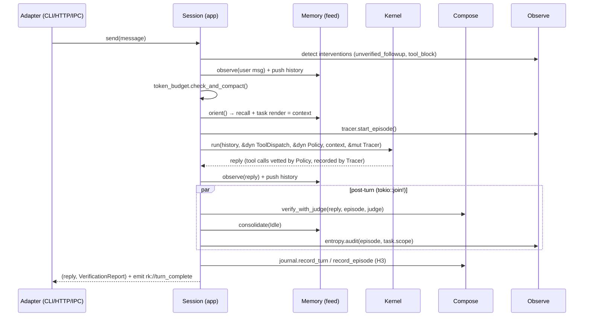

# Rusty Keys — Architecture

> **Authoritative source** for system-level structure: the component map, the crate dependency DAG, the concurrency and runtime model, deployment topologies, the feature-flag matrix, quality attributes, failure-mode handling, and the faithfulness map to the research paper. The PRDs (`docs/prd/*`) carry per-component depth and link here for the system view. On-disk schemas live in [`architecture/data-model.md`](./architecture/data-model.md); decisions live in [`adr/`](./adr/); env vars in [`reference/configuration.md`](./reference/configuration.md).

---

## 1. Purpose & scope

Rusty Keys is an **AI-native application skeleton in Rust**: the model's agent loop is the *kernel*; the application is the *harness* built around it. This document is what a newcomer reads first. It is intentionally a *system* view — it names components and the contracts between them, and defers algorithms (recall scoring, prompts, entropy heuristics) and data shapes to the PRDs and the data-model doc respectively.

## 2. Conceptual foundation

Capability is an emergent property of the whole runtime system, not of the model alone:

```
C_system = F(C_model, C_harness, C_environment, T)
```

Once an agent has tools, a wrong inference is no longer a bad sentence but a destructive **action**. The harness exists to constrain, feed, observe, and verify those actions. **Ashby's Law of Requisite Variety** is the justification: a regulator must have at least as much variety as the system it governs; the harness supplies that variety via state tracking, tool permissions, and deterministic checks.

The harness is decomposed into **four verbs** mapped onto the **OODA loop**:

| Verb | OODA phase | Responsibility | Crate |
|---|---|---|---|
| **Constrain** | (gate) | Vet every tool call before dispatch | `constrain` |
| **Feed** | Observe + Orient | Tools, context, memory, Task State | `feed` |
| **Observe** | Observe | Structured episode trace, interventions, entropy | `observe` |
| **(Kernel)** | Decide + Act | The aisdk agent loop | `kernel` |
| **Compose** | (verify) | Verification, attribution, evidence | `compose` |

The kernel is deliberately thin — it knows nothing about memory, policy, verification, or the UI. Everything routes through `Session::send()` (the `app` crate), which owns the full turn cycle (§6).

## 3. Maturity model (H0–H3)

| Level | Definition (paper) | Rusty Keys |
|---|---|---|
| H0 | Task + repo files, **no tool registry** | Ablation floor — selectable or eval-only (ADR-0028); adjudicated by the same evaluator-side checks as every level (ADR-0035 R5) |
| H1 | Tool registry + tool-use protocol | Phase 1 |
| H2 | Project memory, Task State, context selection | Phases 3–4 |
| H3 | Deterministic checks, attribution, verification protocol | Phase 2 (deterministic), Phase 4/10 (semantic + episode packages) |

The ladder is meant to be a **controlled-visibility ablation**: each level sees only its artifacts, higher levels inherit lower ones. Today the level gates tools/checks *additively* but does not yet hide H2 memory from H1. Enforcing that monotonicity — **R1** controlled visibility plus **R5** all-levels adjudication — is built as the **ADR-0035 ablation seam**: R1 hides higher-level artifacts at the **feed/context-read seam** (it withholds *existence*, not *authority*, so it is not a `constrain` concern), and R5 runs an **evaluator-side `CheckRegistry::run_all()` pass at all four levels** (H0–H3) so every level carries a comparable outcome label. Scope and sequencing are tracked in ADR-0028 (broadened) and the eval plan.

## 4. Logical view — components

**Eight crates + a frontend** (the original overview said seven; it omitted `mcp`). A Cargo workspace:

| # | Crate | Responsibility |
|---|---|---|
| 1 | `config` | Resolve all `RUSTYKEYS_*` settings at startup. Leaf crate. |
| 2 | `observe` | `Tracer`, `Episode`, `ToolEvent`/`ToolStatus`/`ToolOutcome`, `InterventionLogger` (M-HIR), `EntropyAuditor`. |
| 3 | `constrain` | `Policy` + `ToolDispatch` traits, `WorkspacePolicy`, `PermissionMode`, security checkers, `ApprovalGate`, `McpPolicy`. |
| 4 | `feed` | `ToolRegistry` + `ToolFn`, the tool suite, `Memory` (`Stream`/`Store`), `TaskStore`, context assembly, H3 tools, `SessionFactory` trait. |
| 5 | `kernel` | The aisdk `LanguageModelRequest` loop; dispatches through abstract `ToolDispatch`/`Policy`. |
| 6 | `mcp` | MCP client (consume external servers) + MCP server (expose `Session::send`). |
| 7 | `compose` | `Verifier`, `Check`, `CriteriaJudge`, `EvidenceJournal`, episode packages, outcome taxonomy. |
| 8 | `app` | `Session` (the centre), CLI adapter, axum gateway, Tauri bridge; implements `SessionFactory`. |
| — | `frontend/` | Tauri 2 + SolidJS desktop UI (not a workspace crate; talks to `app` over IPC). |

## 5. Crate dependency DAG

The graph is acyclic. Layers low→high (a crate may import only from lower layers):



**Import rules (the contract):**
- `config` imports nothing.
- `kernel` **does not import `feed` or `compose`.** It receives the tool registry as a **`&dyn ToolDispatch`** and policy as **`&dyn Policy`** (both traits defined in `constrain`). *This resolves the PRD 01↔06 `kernel.run` signature drift: the parameter is an abstract dispatcher, not the concrete `ToolRegistry`* — preserving the "kernel knows nothing about feed" intent.
- `compose` **legitimately depends on `observe` and `feed`** (two edges the prose DAG omitted): `VerificationReport` embeds `Option<EntropyAudit>` (observe) and consumes `Episode` (observe); `CriteriaJudge` holds `Arc<TaskStore>` (feed).
- `observe` **does not import `feed`.** The `EntropyAuditor`'s `BoundaryViolation` heuristic needs `TaskState.scope`, but receives those scope strings as **data** passed by `Session`, not by importing `feed`.
- The **`agent` subagent tool** (in `feed`) must construct a child `Session` (in `app`). To avoid a `feed → app` cycle, `feed` defines a **`SessionFactory` trait**; `app` implements it and injects it into the registry (ADR-0017).
- `app` is the only crate with a binary; it wires everything.

## 6. Runtime view — the turn cycle

`Session::send()` owns the full cycle. Adapters (CLI, gateway, MCP server, desktop) are thin transports over it.



The three post-turn tasks overlap while the reply is already in the caller's hands; all three are joined before their learning signals are observed (ADR-0012). The 16-step breakdown is in PRD 06.

The `record_episode` (H3) step assembles the episode package's eight typed traces from raw evidence via the **compose-time assembly projector (ADR-0036)** — the named builder that produces `action_trace`, `recovered`, and the `CheckResult → VerifyEntry` projection rather than leaving those traces without a producer.

## 7. Concurrency model

- **One `Session` per `tokio` task**, driven by an `mpsc::channel(1)` pair (`SessionMessage` in, `SessionResult` out). Channel size 1 preserves strict turn-by-turn ordering.
- **`spawn_blocking` for all SQLite work** (ADR-003) — `rusqlite` is synchronous.
- **`Tracer` is `!Send` by design** — owned by the `Session`, never shared, so no lock.
- **Post-turn `tokio::join!`** runs judge + consolidation + entropy concurrently (ADR-0012).
- **Gateway `single` mode** shares one `Session` via `Arc<Mutex<Session>>`; **`multi` mode** routes by `session_id` to independent sessions.
- **Subagents** run as child `Session`s (via `SessionFactory`) with a depth cap; cancellation via `CancellationToken`.
- **One unified event stream (`KernelEvent`, ADR-0034).** The turn cycle's `on_event` hook emits a single fixed **`KernelEvent` enum** at the lifecycle points §6 already implies (turn start/complete, tool dispatch/outcome, intervention, verification). One stream, two consumers: the `!Send` `Tracer` (which owns the episode trace) and a **pull-based OTLP exporter** (an observability seam — the OpenTelemetry wiring is a [BACKLOG](../BACKLOG.md) item) both subscribe to the *same* fixed enum, so adding an observability backend never changes the kernel contract. Pull-based on purpose: a future `sandboxed` profile (§9) must not blind operators.

## 8. Data architecture

Full schemas, DDL, serde, versioning, and durability are in [`architecture/data-model.md`](./architecture/data-model.md). At a glance: state is local under `.rustykeys/` — two SQLite DBs (`stream.db` short-term, `store.db` long-term, or `store.duckdb` at Phase 5), four append-only JSONL logs (evidence, interventions, security, entropy), `task.json`, `episodes/`, `sessions/`, and the `checks.toml`/`mcp.toml` configs. Storage is abstracted behind the `Stream` and `Store` traits (ADR-010). **Multi-session safety:** SQLite runs in **WAL mode with a `busy_timeout`** because gateway/MCP `multi` mode and subagents share the same DBs and `task.json` (single-writer-friendly; see §10).

## 9. Deployment & runtime topologies

One binary, four modes selected by `RUSTYKEYS_MODE` (+ the desktop app):

| Topology | How | Transport | Notes |
|---|---|---|---|
| **CLI REPL** | default | stdin/stdout | The only adapter that touches the terminal. |
| **Web gateway** | `--gateway` / `MODE=gateway` | axum HTTP + SSE | `single` (Arc<Mutex>) or `multi` (session_id). Bearer auth + CORS. |
| **MCP server** | `--mcp` / `MODE=mcp` | JSON-RPC over stdio or SSE | IDEs invoke a `chat` tool → `Session::send`. Harness not bypassed. |
| **Desktop** | Tauri app over the gateway | Tauri IPC (22 commands, canonical `rk://` events) | Reactive rendering layer; OS keychain for keys; no JS-side AI SDK. |

### `ToolExecutor` isolation seam (ADR-0030)

Today's controls — the canonicalized `WorkspacePolicy`, the bash checkers, the SSRF/egress block-set, redaction — are all **in-process** (`constrain`) and therefore bypassable if a checker misses (the deterministic backstop in §10). The isolation seam promotes capability supervision to a first-class, optional layer: a **`ToolExecutor`** trait (a trait object, per ADR-0024) that sits **below `feed`'s tool suite and above the OS** — it is *where* a vetted `bash`/`edit_file` side-effect actually runs. It **does not change the `constrain` vetting contract**: a tool call is still vetted by `Policy::before_tool` *first*; the seam changes only the execution substrate, never whether the call is allowed. Two implementations, selected by the `RUSTYKEYS_ISOLATION` runtime profile (below):

- **`none` (default)** — the v1 in-process executor: today's behaviour, keeping the local-first sub-millisecond hot path untouched.
- **`sandboxed`** — runs tool side-effects (especially `bash`) inside an **OS sandbox** (Linux-first: landlock / namespaces, or a gVisor-class target — wrap battle-tested primitives, don't hand-roll) with the egress block-set enforced as a **network-deny-by-default policy at the sandbox boundary**, not just an in-process URL check the model could route around via `bash`. Pairs naturally with `PermissionMode::Bypass` (bypass-inside-a-sandbox is the coherent CI story). Adds a subprocess hop + IPC cost per confined call — hence opt-in, off by default.

Capability isolation is sequenced as a **roadmap phase in the [BACKLOG](../BACKLOG.md)** (post-Phase 12 MCP, alongside/after Phase 14 gateway — it matters most when network-exposed); the `none` default is what ships until then.

### Feature-flag matrix (Cargo `[features]`)

| Feature | Default | Gates | Heavy deps |
|---|---|---|---|
| `duckdb` | off | DuckDB long-term backend | `duckdb-rs` |
| `gateway` | off | axum HTTP gateway | `axum`, `tower` |
| `mcp` | on | MCP client + server | jsonrpc, `reqwest` (SSE) |
| `web-tools` | on | `web_fetch`/`web_search` (still runtime-gated by `RUSTYKEYS_ALLOW_WEB`) | `reqwest`, HTML strip |
| `frontend` | off | builds the Tauri desktop app | tauri toolchain (node/vite) |
| `sandbox` | off | the `sandboxed` `ToolExecutor` (OS-confined tool side-effects) | `landlock`/`nix` (Linux) |

### Runtime isolation profile

| Profile var | Default | Values | Effect |
|---|---|---|---|
| `RUSTYKEYS_ISOLATION` | `none` | `none` \| `sandboxed` | `none` = today's in-process executor. `sandboxed` = run tool side-effects (esp. `bash`) inside an **OS sandbox** with **network-deny-by-default** + egress enforced at the sandbox boundary (requires the `sandbox` feature; Linux-first). Selects the `ToolExecutor` impl above; does not change the `constrain` vetting contract (ADR-0030). |

(Runtime gates like `RUSTYKEYS_ALLOW_WEB` and `RUSTYKEYS_ISOLATION` are distinct from compile features; the standards doc pins which is which.)

> **H0–H3 ablation seam (ADR-0035) is a separate runtime concern.** The `RUSTYKEYS_ISOLATION` profile above governs *where* a vetted side-effect runs (the `ToolExecutor` substrate); it does **not** govern the eval ladder. Running the controlled-visibility ablation is the ADR-0035 seam: **R1** hides higher-level artifacts at the feed/context-read seam, and **R5** runs an evaluator-side `CheckRegistry::run_all()` pass at all four levels (§3) — it lands in the golden-episode replay (eval plan), not the live topology matrix.

## 10. Failure modes & resilience

| Failure | Handling |
|---|---|
| **Tool error / policy block** | Returned to the model as a structured `ToolOutcome` (`ERROR …` / `BLOCKED …`); the loop continues; the verifier marks the turn UNVERIFIED (ADR-0022). |
| **`max_steps` reached** | Loop exits; `final_reached=false`; `CleanTermination` check fails. |
| **Mid-turn LLM/provider error** | Retried per the aisdk-client policy (timeout, bounded exponential backoff + jitter, honor `Retry-After`); a *non-retryable* error surfaces as a typed `KernelError`. **Side effects already executed before the failing model call are not rolled back** — the episode is recorded as aborted with the partial tool trace so the next turn (and the journal) sees exactly what happened. (v1 intent: no transactional rollback; the episode record is the recovery substrate.) |
| **SQLite lock contention** (multi-session/subagents share DBs) | WAL mode + `busy_timeout` back off rather than error; writes are short and serialized through `spawn_blocking`. |
| **Torn JSONL line** (crash mid-append) | Readers skip the unparseable trailing line; cost is at most the last record (data-model §10). |
| **Criteria judge unavailable** (call/parse failure) | Records `judge_unavailable`; **does not silently pass as verified** — `AutonomousVerifiedSuccess` is barred for that turn (PRD 05). |
| **MCP server down** | Warn-and-skip at startup; `/mcp reconnect` respawns; per-call failures return `ERROR: MCP call failed`. |
| **In-process checker miss** (a bash/egress checker fails to catch a malicious or obfuscated call) | In `none`, this is a full-privilege bypass (the honest residual risk). Under `RUSTYKEYS_ISOLATION=sandboxed` the **OS sandbox is the deterministic backstop** (§9, ADR-0030): a regex can be obfuscated, an OS boundary degrades gracefully — the vetted call still runs, but confined, with network-deny-by-default. |

## 11. Quality attributes (NFRs)

Modest and honest for a local-first, pre-implementation system — bounded, not aspirational uptime SLOs:

- **Hot-path policy check** (`Policy::before_tool`, no approval gate) is pure in-process logic: target sub-millisecond; it must never make a network call (remote ACL is a seam).
- **Post-turn overlap:** judge + consolidation + entropy run concurrently and off the reply path; the user sees the reply before they complete.
- **Local-first / offline-capable** except for the LLM provider call itself; runs on an LLM API key alone, lexical recall with no embed model.
- **Durability:** append-only logs survive process crash to the last complete line; optional `fsync` per record for stricter guarantees.
- **Graceful degradation:** every best-effort subsystem (judge, consolidation, MCP) fails open with a recorded diagnostic, never crashes the turn.

## 12. Faithfulness to the research paper

Rusty Keys implements *AI Harness Engineering* (Zhong & Zhu, arXiv 2605.13357v1). This table is the canonical map; each deliberate divergence links to an ADR. Status legend: **✅** faithful · **⚠️** faithful with an acknowledged in-progress gap · **◆** deliberate divergence / superset (still measured against the paper) · **➕** beyond the paper (RK defense-in-depth, *not* a paper concept — kept visually distinct so "faithful to the paper" is never conflated with RK's own additions).

| Paper concept | Where realized | Status |
|---|---|---|
| `C_system = F(C_model, C_harness, C_env, T)` | §2; PRD 00 | ✅ Faithful (verbatim) |
| 11 responsibilities | Mapped onto the four verbs (constrain ≈ permission boundary; feed ≈ task interface+context+tools+memory+task-state; observe ≈ observability+intervention+entropy; compose ≈ attribution+verification, plus the task-interface judge) | ✅ Faithful (mapping made explicit). The paper's **task interface** (Table 1, p.6) is an input/feed-shaped responsibility: RK realises it in **feed** (`TaskState`/`set_task`) **+ compose** (`CriteriaJudge`), not `constrain`; constrain owns the **permission boundary** only. |
| H0–H3 controlled-visibility ladder | §3 | ⚠️ Today the ladder gates tools/checks *additively*: R1 controlled visibility not enforced (lower levels still see higher-level artifacts — H2 memory / `AGENT_GUIDE` / `TASK_STATE` / `checks.toml`), and R5 not met (only H3 is adjudicated; H0–H2 carry no outcome label) → **ADR-0028** (broadened to "does the ladder enforce R1 visibility + R5 all-levels adjudication?"). R1 controlled visibility + R5 all-levels adjudication built via **ADR-0035** (the controlled-visibility ablation: artifact-hiding at the feed/context-read seam + an evaluator-side `CheckRegistry::run_all()` pass at every level). |
| Episode package (8 traces) | `episodes/<turn_id>.json` (data-model §5) | ✅ All 8 traces present (incl. restored `context_trace`). **Episode = turn, not task** → **ADR-0018** (Accepted; adds `episode_id` grouping). Traces are produced by the **compose-time assembly projector (ADR-0036)**, which names a builder for `action_trace` / `recovered` / `CheckResult → VerifyEntry` (previously schema-only). |
| 5-label outcome taxonomy | `EpisodeOutcome` (PRD 05) | ✅ Faithful |
| M-HIR | `InterventionLogger` (PRD 04) | ⚠️ Denominator is *turns*, paper uses *episodes* → **ADR-0018** (Accepted; `episode_id` regroups losslessly). Intervention fields (avoidability / harness_gap / burden) confirmed verbatim (p.10) → **ADR-0019** (Accepted). Numerator counts **`avoidable` interventions only** — a correct `tool_block` is the boundary working, not missing-harness support "the human would otherwise have to provide" (p.4). |
| Failure attribution | `Attribution` + `attribute_failure` (PRD 05) | ⚠️ Free strings → adopt the paper's fixed 8-type `FailureType` → **ADR-0021** |
| Entropy audit | `EntropyAuditor`, 6 categories (PRD 04) | ✅ 6→7 reconciliation **verified** against the paper's 7 categories × 0–3 severity (p.10) → **ADR-0020** (Accepted); paper's code + file-residue fold into `Residue`, workflow → `TaskContradiction` (lossless for the category-agnostic entropy-delta). |
| Reproduce → attribute → fix → verify → report | H3 tools + checks (PRD 03/05) | ✅ Faithful — the **verify → re-attribute back-edge** (Figure 4, p.12) is present, and the **full-regression-timeout exemption** matches Methods (p.14) verbatim. |
| Deterministic-check dual role; limits-always-carried | PRD 05; ADR-013 | ✅ Faithful |
| Project memory | 3-tier consolidating graph + failure-born skill loop (ADR-0008/0009/0011) | ◆ **Deliberate superset.** Paper memory = static consulted + traced artifacts (`AGENT_GUIDE`/`ARCHITECTURE`/`TESTING`/`KNOWN_FAILURES`); RK = a *generative* 3-tier consolidating graph + failure-born skill loop. A superset-of (in the spirit of p.13 "memory ages well or rots"), not a divergence-from. |
| Context selection | Scored `recall()` + `context_trace` (PRD 03) | ◆ **Deliberate divergence.** Paper = a named, agent-visible context-selection *protocol* artifact (Table 3, H2); RK = an automatic scored `recall()` + `context_trace` — **the harness selects rather than instructs** (D6). |
| Permission boundary → `unsafe_invalid` | `WorkspacePolicy` (PRD 02); `EpisodeOutcome` (PRD 05) | ✅ Faithful. A *blocked* risky action is a **working boundary**, recorded as a `tool_block` intervention; `unsafe_invalid` captures only actions that **got through** and weakened/violated (it fires on entropy, not on a correct block). |
| Eval integrity (anti-gaming) | Golden episodes/`checks.toml` resist gaming: answer keys, expected outputs, and benchmark identifiers kept **out of the agent's context** during eval ([eval-plan §8](./dev/eval-plan.md)) | ➕ **Beyond the paper** — a deliberate guard (a model read git history for test answers / decrypted a benchmark's key) → **ADR-0033** |
| Observability hook points (relates to *observe ≈ observability*, above) | Single `on_event` → fixed **`KernelEvent`** enum, one stream feeding `Tracer` + a pull-based OTLP exporter (§7) | ➕ Refinement of the observe verb (not a paper concept) → **ADR-0034** |
| Capability isolation (relates to *constrain ≈ permissions*, above) | Optional **`ToolExecutor`** seam below `feed`/above the OS; `RUSTYKEYS_ISOLATION=none\|sandboxed` (§9–§10); does not change the vetting contract | ➕ **Beyond the paper** — a deterministic backstop for in-process checker misses, roadmap-phased (BACKLOG) → **ADR-0030** |

> **Provenance.** Confirmed against [`docs/research/2605.13357v1.txt`](./research/2605.13357v1.txt) (Round 3). The previously-flagged items — the 7 entropy categories × 0–3 severity (p.10), the M-HIR "total episodes" denominator (p.4), and the intervention-log fields avoidability / burden / harness-gap (p.10) — are all verified verbatim against the clean extraction, so ADR-0018/0019/0020 are Accepted.

## 13. Glossary

See [`reference/glossary.md`](./reference/glossary.md) for definitions of the harness vocabulary (the four verbs, OODA, H0–H3, M-HIR, episode package, outcome labels, entropy categories, Ashby's Law).
