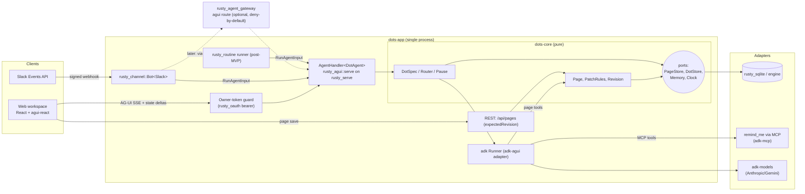

# Dots-style always-on agents, composed from rusty_mill

Date: 2026-10-07 · Status: **design only, awaiting approval** (no code, no PR) · Base: `main` @ 4506e96

## 0. Verdict

| Question | Answer |
|---|---|
| Is most of this already built? | Yes. Channels, routines, sandboxed bots, gateway policy, AG-UI server/client and React/Vue/Angular bindings all landed under ADR-0007 (`docs/dev_phases/ADR_0007/FOLLOW-ONS.md:17-33`). |
| What is actually missing? | (a) a **Dot** domain (agent spec, routing, pause), (b) a **pages** workspace (domain, store, REST, editor UI), (c) **persistence** for threads/routines/pages, (d) **auth on the AG-UI endpoint**, (e) a daemon that composes the above, (f) AG-UI 1.0 deltas (§5). |
| New crates | **2** (`dots-core`, `dots-app`) plus a `web/` dir. Nothing else. |
| Biggest risk | Blocking `rusty_serve` holding one thread per SSE stream (§7). |

## 1. Evidence base

| Source | What it gave | Confidence |
|---|---|---|
| OpenDots clone, `CopilotKit/OpenDots` @ 625452e (2026-10-06), MIT, **alpha**, "template" | Architecture (§2) | High for code paths cited; README says live Slack is **unverified** (`README.md:212`) |
| `docs.ag-ui.com`, GitHub releases | AG-UI **1.0.0 shipped 2026-09-17** ("Ships the AG-UI 1.0 specification, JSON Schema"); `@ag-ui/{core,client}` now **1.0.2** (release/2026-10-05) | High (fetched). Spec pages were summarised by a small model: re-check against the JSON Schema before coding (task 1) |
| `docs/research/CONSOLIDATION-AUDIT.md` | **Not on `main`.** Read from `origin/claude/peaceful-dirac-200syz`. Its steps 1-3 (bearer helper, `constant_time_eq`, `Emitter` helpers) are **not on `main`** yet (grep: no `token_from_authorization`, no `Emitter::tool_call`) | High |
| remind-me | Nexus unused (`mem_e81f28b4`); goal of OpenBot-shaped platform (`mem_564ef208`); Agent OS / Hermes on LXC 107 is a **separate homelab stack** (`mem_15b753fd`, `mem_4aad781c`) | High |
| Repo inventory (crate READMEs + spot checks) | §3 | Medium: LOC/test counts are greps, nothing was built or run |

## 2. OpenDots architecture (reference, not a dependency)

| Aspect | OpenDots (path in clone) | Take / leave |
|---|---|---|
| Stack | TS monolith: Hono server (5.5k LOC), React 19 + TipTap, Node 24, `node:sqlite` | Leave |
| Agent lifecycle | **No long-lived agent.** A Dot = definition (name, instructions, tool permissions; `src/server/workspace.ts`, `dot-agent.ts`), invoked per turn | **Take**: matches `AgentHandler` (one run per POST) |
| "Always-on" | 1 s poller leases one task from SQLite (`runner.ts`, `store.ts`: `intervalSeconds`, `nextRunAt`, `leaseUntil`); 90 s timeout; stale lease => *Interrupted*, manual retry; global `paused` switch honoured by Slack/voice/runner | **Take** schedule + pause semantics; `rusty_routine` already covers cron |
| Call | Browser WebRTC to OpenAI Realtime; delegates long work to a "compute" agent in same thread (`voice.ts`); no PSTN | Defer (§3 row 7) |
| Message | Slack via CopilotKit Channels SDK + **managed Intelligence adapter**: mention subscribes thread, replies in thread, owner-only allowlist (`slack-channel.ts`); approval cards unsupported in Slack | **Take** shape; ours is self-hosted (`rusty_channel::slack`) |
| Workspace | Space → Pages; page = SQLite row (parent, title, markdown <=100k, `revision`, `sourceThreadId`; `pages.ts`); agent tools `list/read/create/edit_space_page`; create goes through a human approve card | **Take** model; leave TipTap-grade editor for later |
| State sync | **REST + polling + optimistic `expectedRevision` (409)**. Grep found no `STATE_SNAPSHOT/DELTA/MESSAGES_SNAPSHOT` use in `src/` | Improve: we already have STATE_* + JSON Patch |
| AG-UI usage | Via CopilotKit runtime; `useAgent`, `useRenderTool`, `useHumanInTheLoop`; runtime route allowlist (`runtime-scope.ts`) | Equivalent exists: `agui-react` |
| Auth | Single owner: optional `OWNER_TOKEN` (timing-safe), else localhost/origin checks; no tenancy | **Take** for MVP |
| Persistence | App SQLite (pages, dots, tasks, MCP approvals, audit). **Conversations live in CopilotKit Intelligence** (hosted or Docker, required for chat). MCP tokens plaintext | **Leave Intelligence**; it is the main sovereignty cost |
| Tools | Per-Dot MCP (Streamable HTTP + bearer); read-only tools auto-run, others need owner "Approve & run" (1 h expiry) | Take; gateway CEL already gates MCP |
| Sandbox | Per-Dot Docker "computer" (OpenBot supervisor), HMAC creds, audit table | Defer; `rusty_sandbox` is the lighter equivalent |
| Not included (README) | Shared editing, invitations, uploads, goal/event triggers, multi-Dot groups | Out of scope for us too |

## 3. Capability map

Effort S/M/L. "Crate" paths are under `crates/`. Rows marked **gap** drive §4.

| # | Capability | OpenDots approach | rusty_mill crate (evidence) | Gap | Effort |
|---|---|---|---|---|---|
| 1 | Agent runtime + tool loop | TanStack AI per turn | `libs/rusty_adk`: `adk-runner/src/lib.rs:79` `Runner`, `adk-agents/src/agent.rs:24`, HITL suspension; sessions in-memory or SQLite (`adk-sessions`). Alt: `apps/rusty_key` (`Session`, `ApprovalGate`) | Assemble a `Runner` from a Dot spec (**gap**) | M |
| 2 | LLM access | OpenAI-compatible | `adk-models` (Anthropic, Gemini, Mock). `apps/rusty_provider` is an app: reachable over HTTP only (ADR-0003) | None for MVP | S |
| 3 | AG-UI protocol | CopilotKit runtime | `libs/protocol/rusty_agui` (31 events, verifier, reducer, SSE, `serve`, `client`); adapter `libs/rusty_adk/crates/adk-agui` | §5 | M |
| 4 | Web chat, generative UI, HITL | `useAgent`/`useHumanInTheLoop` | `rusty_agui/packages/{agui-core,agui-react}` (`useAgent`, `useAction`, `useSharedState`) | No chat components, only hooks | M |
| 5 | Slack | Channels SDK + managed adapter | `libs/protocol/rusty_channel`: `slack.rs`, `bot.rs` `Bot<C>`, sans-IO `Channel` (`lib.rs:140`) | Retries dropped, no in-flight store; no proactive post (needs reply target w/o inbound) | S-M |
| 6 | Other channels | none | `teams.rs`, `sms.rs` exist | none needed | - |
| 7 | Voice call | OpenAI Realtime over WebRTC | `libs/ai/rusty_whisper` (STT), `libs/ui/rusty_audio` (Windows-only capture) | No TTS, no WebRTC/telephony. **Defer**; browser speech API => text over AG-UI is S | L |
| 8 | Scheduling | SQLite lease poller | `libs/protocol/rusty_routine` (own cron, disable after N failures; `Routine::fire/record`) | State not persisted; reply only printed, not delivered to a channel | M |
| 9 | Always-on supervision | `npm run`/Docker | `libs/rusty_bot` `Fleet` (all-up/all-down, no restart policy). Single process under systemd is enough for MVP | Restart/health only if >1 process | S |
| 10 | Sandboxed "computer" | Docker per Dot | `libs/rusty_sandbox` (Landlock+seccomp, Linux), `rusty_bot::BotSpec` | No browser tool; Linux only. **Defer** until a Dot gets shell/file tools | M |
| 11 | Spaces/pages domain | `pages.ts` | none | **New**: `dots-core` | M |
| 12 | Page editor UI | TipTap | React 18/Vite/zustand/Tailwind stack in `apps/rusty_tick/web`; `agui-react` | **New**: `web/` (textarea/markdown first) | M |
| 13 | State sync agent<->human | REST + polling | `rusty_agui` STATE_SNAPSHOT/DELTA, `foundation/rusty_json_patch`, `useSharedState` | Wire pages onto shared state | S |
| 14 | Conversation store | CopilotKit Intelligence (hard dep) | `adk-sessions` SQLite; thread history is also replayed by client in AG-UI (`RunAgentInput.messages`) | Choose source of truth (Q3) | S |
| 15 | App store (pages, Dots, bindings, routines) | `node:sqlite` | `libs/storage/rusty_sqlite` (1.1k LOC, 21 tests) or `rusty_multimodal_db_engine` (backs `rusty_tick`, FOLLOW-ONS Q2) | Decide (Q2) | S |
| 16 | Memory | per-Dot memories + "Automatic Learning" | `apps/rusty_remind_me` (MCP: `remind_me_mcp` stdio, `remind_me_remote` Streamable HTTP + bearer/OAuth) via MCP only | None: adapter | S |
| 17 | Tools / MCP | `@modelcontextprotocol/sdk` | `adk-mcp` (client toolset), `libs/protocol/rusty_mcp`; gateway `agentgateway-mcp` allow/deny + CEL | Audit row 11: MCP client is converging on `rusty_mcp`; use `adk-mcp` now, follow later | S |
| 18 | Policy + audit | `computer_audit` table | `apps/rusty_agent_gateway` `agentgateway-agui` (`AguiGateway::check`, deny-by-default CEL, pre/post audit as tracing target `agentgateway::audit`) | Audit is logs, not a store | S |
| 19 | Auth (single owner) | `OWNER_TOKEN` | `libs/net/rusty_oauth/src/bearer.rs`, constant-time compare (audit rows 1-2) | `AgentHandler` has **no auth**; audit helpers not on `main` | S |
| 20 | Multi-user | none | `rusty_tick` per-user tokens (`auth.rs`) | Out of scope | - |
| 21 | Observability | telemetry (on by default) | `tracing` | None for MVP | S |

## 4. Architecture

Modular monolith, one process. Domain (`dots-core`) has no I/O; every arrow to the outside is a port with an adapter in `dots-app`. A service is extracted only on a forcing function (§4.3).

### 4.1 Domain (`dots-core`, no I/O, `#![forbid(unsafe_code)]`)

| Type | Rule it owns | Illegal state made unrepresentable |
|---|---|---|
| `DotSpec` | name, instructions, granted tools, allowed channels | tool not granted => not callable (checked by type, not at runtime string match) |
| `Router` | `(channel, external user, conversation) -> (DotId, ThreadId)`; owner allowlist | unknown identity has no route |
| `Pause` | one switch honoured by channels, routines, handler | runs refused while paused |
| `Page` / `PagePatch { expected_revision }` | revision bump, size cap (OpenDots: 100k chars), parent cycle check | stale patch returns `Conflict(current)`, never overwrites |
| Ports | `PageStore`, `DotStore`, `Memory`, `Clock` | I/O only behind traits |

### 4.2 Page sync (our improvement over OpenDots polling)

| Direction | Mechanism |
|---|---|
| Human -> store | `PUT /api/pages/:id {markdown, expectedRevision}`; 409 on stale |
| Agent -> store | adk tool `edit_page` calls the same `PagePatch` rule (so agent and human race under one rule) |
| Agent -> open view | `STATE_DELTA` (RFC 6902, `rusty_json_patch`) on the thread's shared state; the view's `useSharedState` applies it |
| Open view -> agent | current page `{id, revision, markdown}` rides `RunAgentInput.state`; page content is wrapped as **untrusted data** in the prompt (OpenDots does the same) |
| Concurrent human typing | not solved; conflict dialog. No CRDT (YAGNI; OpenDots has none either) |

### 4.3 Service-extraction forcing functions (none met today)

| Candidate | Trigger that would justify extraction |
|---|---|
| Sandboxed computer | Dot gets shell/file/browser tools => run as `rusty_bot` child (already a process boundary) |
| Channel runner | Needs independent scaling or its own public ingress/TLS posture |
| Routine runner | Needs HA separate from the web process |
| Gateway | Already separate (`rusty_agent_gateway`); put in front once more than one Dot/channel exists |

## 5. Crate plan

### 5.1 Reused as-is

`rusty_agui` (`serve`,`client`), `rusty_json_patch`, `rusty_serve`, `rusty_http`, `rusty_tls`, `rusty_channel` (`bot`), `rusty_routine`, `rusty_oauth` (bearer, HMAC), `rusty_sandbox`+`rusty_bot` (later), `adk-{core,runner,agents,tools,models,sessions,mcp,agui}`, `rusty_sqlite` *or* `rusty_multimodal_db_engine` (Q2), `rusty_agent_gateway` (agui route), `rusty_remind_me` (MCP only, no crate dependency, per `docs/research/memory-sync-contract/README.md`), `agui-core`/`agui-react` TS packages.

### 5.2 New

| Crate | Layer / path | Why it is justified | Real call sites |
|---|---|---|---|
| `dots-core` | apps family, `crates/apps/rusty_dots/crates/dots-core` | Domain with zero home today: Dot spec, routing, pause, page revision rules. Pure and unit-testable. | `dots-app` handler, REST, adk page tools, routine runner |
| `dots-app` | apps family, `crates/apps/rusty_dots/crates/dots-app` (bin) | Composition root: adapters for stores, MCP memory, adk tools, Slack runner, auth; serves `web/dist` | the daemon |
| `web/` (not a crate) | `crates/apps/rusty_dots/web` | Workspace UI; React stack and `agui-react` already used by `rusty_tick/web` | browser |

Consciously **not** created: registry crate (a table in `dots-app`), auth crate (use `rusty_oauth`), MCP crate (use `adk-mcp`/`rusty_mcp`), memory crate (remind_me over MCP), channel crate (`rusty_channel`), supervisor crate (systemd until two processes exist). Split a store adapter out of `dots-app` only when a second backend exists.

### 5.3 Changes to existing crates (additive, each its own PR)

| Crate | Change | Reason |
|---|---|---|
| `rusty_agui` | §6 deltas | 1.0 conformance |
| `rusty_agui::serve` or `dots-app` | bearer guard on `AgentHandler` (prefer a wrapper `Handler`, keep lib auth-free) | FOLLOW-ONS gap "CORS and authentication" |
| `rusty_channel` | persist in-flight run + thread map via a port; proactive reply target | Slack retries are dropped; routines need to post unprompted |
| `rusty_routine` | serialise `Routine` state; deliver reply through a `Channel` target | currently prints and forgets |

### 5.4 Layer check (ADR-0003)

`dots-*` are apps => may depend on libs/foundation. `dots-app` must **not** depend on `rusty_remind_me`, `rusty_provider` or gateway crates (other app families): they are reached over MCP/HTTP. `adk-*` and `rusty_channel` are libs: legal.

## 6. AG-UI 1.0 conformance deltas for `rusty_agui`

Baseline: AG-UI 1.0.0 (2026-09-17), SDKs 1.0.2. Crate is 0.1.0. `conformance/package.json:12` already pins `@ag-ui/client ^1.0.2`; **whether CI is green against it was not run here.** "Checked" = I read the source.

| # | Item | Spec (docs.ag-ui.com) | Crate (file) | Checked | Delta | Blocks MVP? | Effort |
|---|---|---|---|---|---|---|---|
| D0 | Run conformance + fixtures against 1.0.2 and the published JSON Schema | schema ships with core 1.0.0 | `conformance/`, `fixtures/` | no | Confirm green; add schema-validation of fixtures | **Yes (gate)** | S |
| D1 | Interrupts | `RUN_FINISHED.outcome = {type:"interrupt", interrupts:[{id,reason,message?,toolCallId?,responseSchema?,expiresAt?,metadata?,subagentRunId?}]}` | `RunOutcome::Interrupt(Vec<Value>)` untyped (`event.rs:12`); `AgentHandler` always emits success | yes | Typed `Interrupt`; handler can finish with interrupt | No (workaround exists) | M |
| D2 | `RunAgentInput.resume` | `[{interruptId,status:"resolved"\|"cancelled",payload?,metadata?}]`; must cover **all** open interrupts; replay-safe; else `RUN_ERROR` | absent (`grep resume` hits only a doc comment) | yes | Add field + enforcement rules 1-8 | No | M |
| D3 | HITL today | n/a | `request_input` frontend tool (FOLLOW-ONS:173-177) | - | Keep for MVP; migrate to D1+D2 when `agui-*` bindings gain interrupt support | - | - |
| D4 | Parallel tool calls / tolerant ordering | clients tolerate interleaving, group by id | Verifier forbids two of text/tool/reasoning open at once (`verify.rs:12-13`) | yes | Relax per-id state machine | **Likely yes** (real models emit parallel calls) | M |
| D5 | Multimodal input | image/audio/video/document parts with `data`/`url`/`file` sources | only text + legacy `binary` part (`types.rs`; grep: no Image/Audio/Document) | yes | Add parts + sources | No (attachments later) | M |
| D6 | Capabilities discovery | `getCapabilities()` | absent | yes | Type + optional endpoint | No | M |
| D7 | Reasoning encrypted value | `subtype, entityId, encryptedValue` | present (`event.rs:240-244`) | yes | none (an earlier sub-report said otherwise; wrong) | - | - |
| D8 | `ToolCallResult.role`, `ToolCall.encryptedValue`, per-message `metadata`, assistant `encryptedContent` | per spec pages | not confirmed | partly | Verify, add if missing | No | S |
| D9 | `THINKING_*` | deprecated, removal at 1.0 | absent | grep | none unless legacy peers matter | No | - |
| D10 | MetaEvent (draft) | draft | absent | grep | skip until stable | No | S |
| D11 | Binary (protobuf) transport | `@ag-ui/proto` | absent | grep | skip: needs Tier A/vendored protobuf; SSE is sufficient | No | L |
| D12 | Python SDK fixtures | `ag-ui-protocol` | none | grep | add later | No | M |
| D13 | Async server | n/a | `Agent::run` is blocking; ADK uses `block_on` | yes | see risk R1 | Maybe | M-L |

## 7. MVP slice

**One Dot ("Scribe"), one channel (Slack), one workspace view (pages + chat), end to end over AG-UI.**

Scope: Scribe reads and edits pages, recalls and stores memory (remind_me over MCP), answers in the web chat and in Slack threads. Single owner. No voice, no routines, no sandbox, no gateway, no multi-Dot.

### Ordered tasks

| # | Task | Output / test gate | Effort | Depends |
|---|---|---|---|---|
| 0 | **You approve this design** and answer §9 | decision record | - | - |
| 1 | D0: run `rusty-agui-conformance` on 1.0.2; schema-validate fixtures | green CI or a concrete delta list | S | 0 |
| 2 | Land audit steps 1-3 (bearer helper, `constant_time_eq`, `Emitter` helpers) or confirm we call current locations | no duplicate helper added | S | 0 |
| 3 | `dots-core`: `Page`/`PagePatch`/conflict rules, `Router`, `Pause`, ports | unit tests: stale revision => Conflict; size cap; cycle; unknown identity unrouted; paused refuses | M | 0 |
| 4 | Store adapter (Q2) implementing `PageStore`/`DotStore`; file-backed | contract tests run against an in-memory fake and the real adapter | M | 3 |
| 5 | `dots-app` skeleton: `rusty_serve` + owner-token guard + `AgentHandler` with a mock `Agent` | e2e: unauthenticated POST => 401; authed run => RUN_STARTED..RUN_FINISHED | S | 1,2,3 |
| 6 | `DotAgent`: adk `Runner` from `DotSpec` + page tools + `adk-mcp` memory toolset; state delta on `edit_page` | scripted-model e2e over a socket (pattern of `adk-agui/tests/end_to_end.rs`) | M | 3,4,5 |
| 7 | D4: relax verifier for parallel tool calls | verifier tests for interleaved ids | M | 1 |
| 8 | REST `/api/pages` with `expectedRevision` | 409 test; agent and REST race test | S | 4,5 |
| 9 | `web/`: page tree, markdown editor, chat panel with `useAgent`+`useSharedState`, conflict dialog | Vitest + Playwright (as `rusty_tick/web`) | M | 6,8 |
| 10 | Slack: embed `rusty_channel::Bot<Slack>` pointing `AGENT_URL` at loopback; persist in-flight runs via port (retry drop fix) | signature, retry, thread-key tests (exist); new: crash-between-200-and-reply test | M | 6 |
| 11 | Live Slack run via tunnel; record result honestly (OpenDots itself has not verified theirs) | manual checklist in doc | S | 10 |
| 12 | Hardening: pause switch end to end, body/size limits, audit via tracing | tests | S | 9,10 |

Post-MVP (unordered): D1+D2 interrupts; routines with persistence + channel delivery; gateway in front; `rusty_bot` sandbox when a Dot gets shell tools; voice via browser speech; Teams/SMS (already built, just bind).

## 8. Risks

| ID | Risk | Evidence | Mitigation |
|---|---|---|---|
| R1 | `rusty_serve` is blocking thread-per-connection; each open SSE stream holds a thread; ADK runs under `block_on` | `rusty_serve` 768 LOC / 8 tests; FOLLOW-ONS "Departures" step 1 & 10 | Fine for one owner. Load-test in task 5/6; async handler is the first extraction pressure |
| R2 | Verifier rejects parallel tool calls real models emit | `verify.rs:12-13` | Task 7 early |
| R3 | adk and `rusty_key` both embed MCP clients; audit says converge on `rusty_mcp` | audit §2.5 | Use `adk-mcp`; swap when audit row 11 lands |
| R4 | Audit steps 1-3 sit on an unmerged branch | grep on `main` | Task 2 |
| R5 | `adk-models` uses reqwest 0.12, tokio | audit §2.6 | Tier A accepted; no new dep from us |
| R6 | Slack retries dropped, run lost between 200 and reply | FOLLOW-ONS "Step 5 ignores Slack's retries" | Task 10 |
| R7 | No auth/CORS on `AgentHandler`; exposing it equals an open agent with tools | grep: `rusty_serve` exposes `authorization` header only | Task 5; bind loopback + tunnel only |
| R8 | Prompt injection through page content and Slack text, with write tools | OpenDots treats page content as untrusted; same | Wrap as data; page-create/edit approval for non-owner-origin runs; MCP tools read-only by default |
| R9 | Thread-history source of truth unclear (client replay vs `adk-sessions`) | row 14 | Q3 |
| R10 | Linux-only isolation; user also develops on Windows (`mem_f7dd69ff`) | `rusty_sandbox` | Not on MVP path |
| R11 | Gateway README stale ("A2A/LLM not built") | inventory | ignore, fix in docs-loop |
| R12 | CopilotKit React SDK not in CI, only `@ag-ui/client` | FOLLOW-ONS:110-117 | Keep `copilotkit-demo` as manual check |
| R13 | This design overlaps the homelab **Agent OS / Hermes** stack (LXC 107) | remind-me | Q5 |

## 9. Open questions (need your decision)

| Q | Decision | Recommendation |
|---|---|---|
| Q1 | Agent runtime: `rusty_adk` or `rusty_key`? | **adk**: libs-layer, graph + HITL suspension, SQLite sessions, `adk-mcp`, no external `aisdk`. `rusty_key` is an app; its approval gate is richer but app-to-app dependency is illegal |
| Q2 | App store: `rusty_sqlite` or `rusty_multimodal_db_engine`? (FOLLOW-ONS open Q2) | `rusty_sqlite` for relational page tree and revisions, **after** a half-day spike confirming it covers transactions + the tree query; engine if you want one store across `rusty_tick`, remind_me |
| Q3 | Conversation source of truth | Client replays `messages` (AG-UI default) plus `adk-sessions` for server-side thread state; **no Intelligence-like hosted store** |
| Q4 | MVP channel = Slack (as scoped) vs Teams/SMS first | Slack; adapters for the others already exist |
| Q5 | Relationship to Agent OS / Hermes: replace, coexist, or have Dots be a UI/runtime Hermes can call? | Coexist; keep scopes separate until MVP proves value |
| Q6 | Gateway in MVP? | No. Add when a second Dot or channel arrives; MVP uses owner token |
| Q7 | Landing audit steps 1-3 first (task 2) or code against current locations? | Land first (small, reviewed) |
| Q8 | Voice: defer entirely, or browser speech API in MVP+1? | Browser speech => text; no WebRTC/TTS crate until a forcing function |
| Q9 | Location/name: `crates/apps/rusty_dots` OK? Any name conflict with your other "Dots" notes? | OK |
| Q10 | Interrupts (D1+D2): build now for conformance, or keep the `request_input` tool workaround until a consumer needs it? | Keep workaround; build with first consumer (YAGNI), but track as conformance debt |

## 10. Not verified

- Nothing was built, run or tested; CI state of `rusty-agui-conformance` is unknown.
- OpenDots: live Slack, Intelligence/Channels internals, STATE_* use inside the SDKs, the press announcement text (search snippet only).
- AG-UI spec details come from summarised fetches of docs.ag-ui.com; D1/D2 field lists should be re-read against the JSON Schema in task 1. Capabilities and binary-transport specifics unchecked.
- `rusty_serve` auth/CORS behaviour (only saw an `authorization` header accessor), `rusty_routine` persistence, `adk-sessions` SQLite semantics, `rusty_sqlite` fit for tree queries: read as described, not exercised.
- Agent OS / Hermes details are from remind-me notes only.
